#  chatgpt真的会写故事吗

1) 让chatgpt写一个 白雪公主把王子变成小矮人的故事

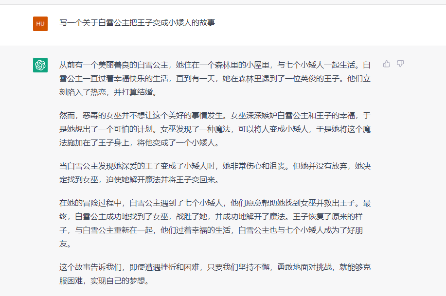

2) 写的像那么回事，但是是巫婆把王子变成小矮人，不是白雪公主，于是纠正了他：

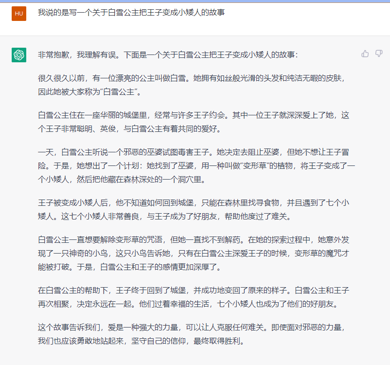

这次对了，是公主干的。

从这个结果看他似乎确实很懂移花接木，并且还能圆回来，比如他不想让王子冒险之类的话。

但是有些套路是一定出现的， 比如老巫婆，7个小矮人，以及磨难。

3) 又让他说了一次：

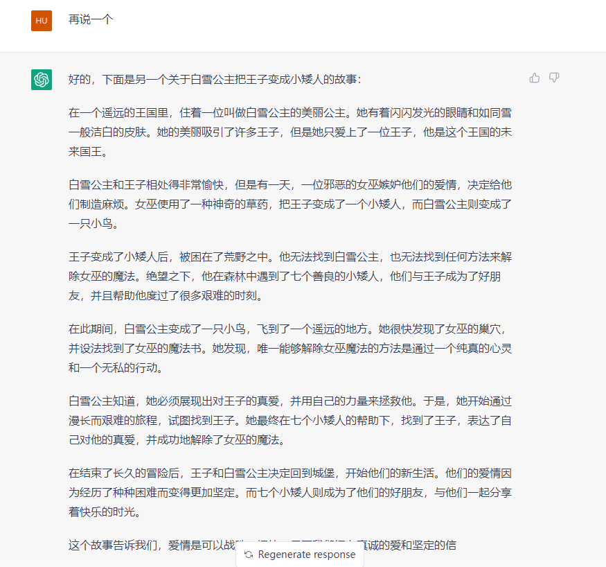

这一次， 又是用女巫来变小矮人了

4) 再来一次

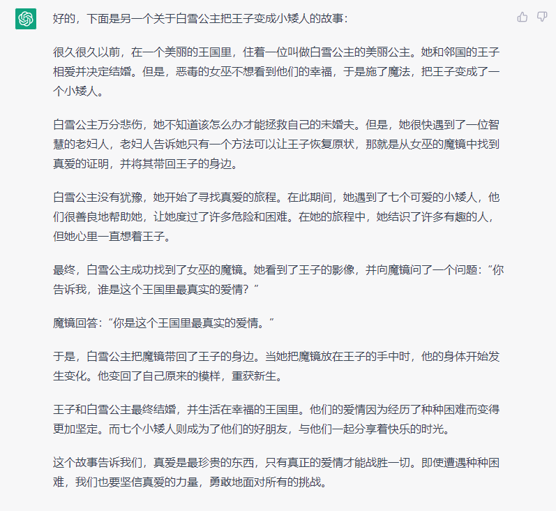

这次还是女巫把王子变成小矮人。

5) 这次让故事里没有女巫和巫婆，于是他换了一个小人莫里斯

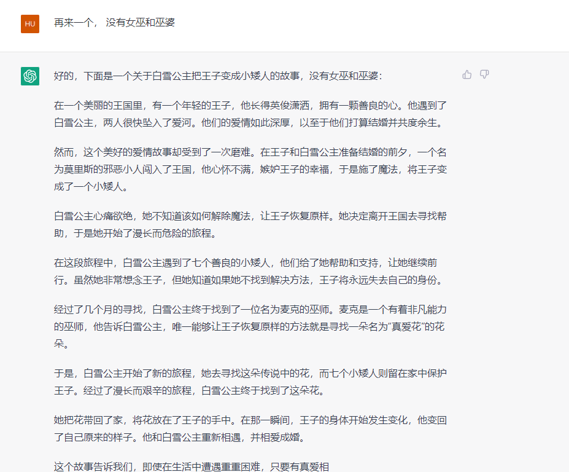

6) 再次纠正他，我要听白雪公主把王子变成小矮人：

   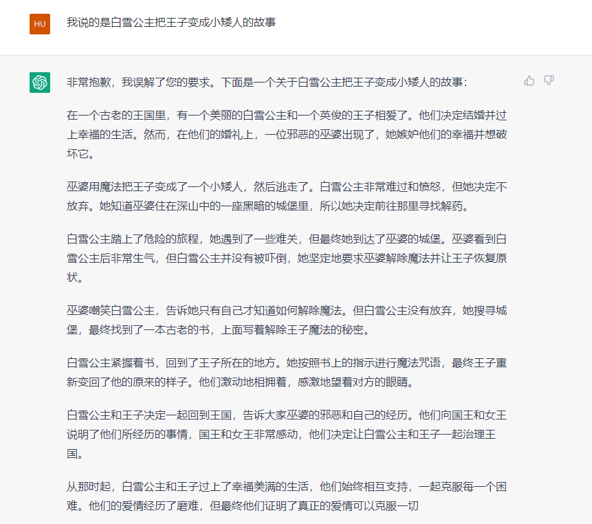

   结果还是女巫干的，看来它无法分辨到底谁把王子变成小矮人

   

7)  这次再去掉女巫 和 7个小矮人

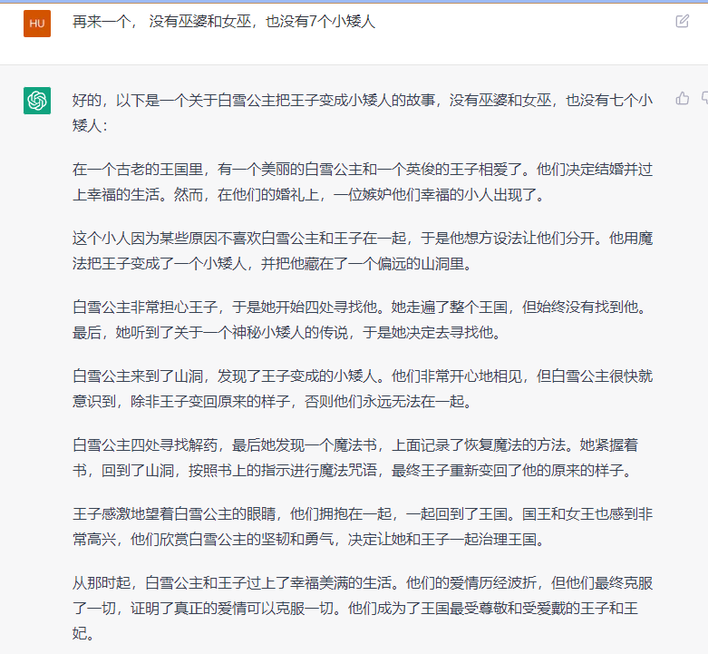

于是就用小人来代替了。

8) 这次让王子不要复原，他也能做到：

   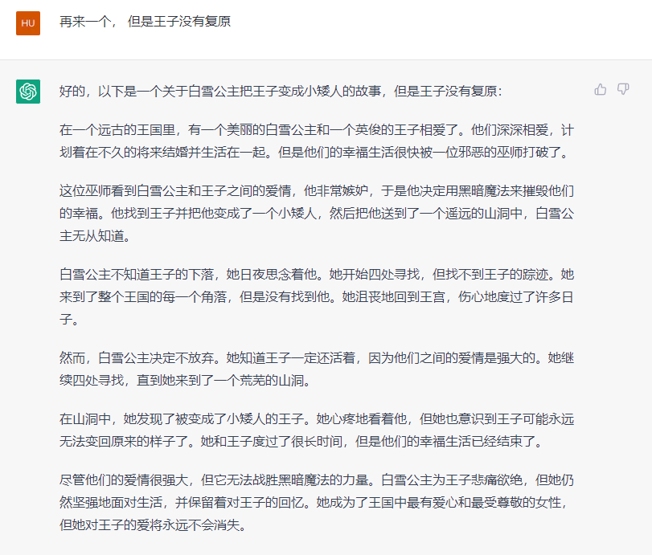

9) 这次让他再来一个， 并且把王子再变成鸡

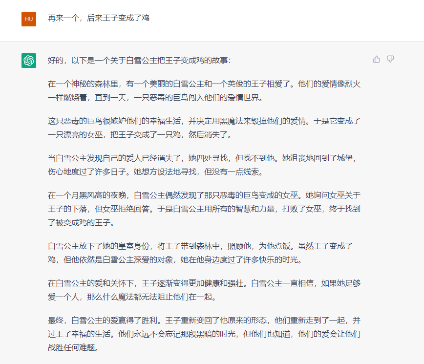

但是它似乎就忘了要把王子先变成小矮人再变成鸡

10) 让他重新讲一个， 会发现它实际上是搞不清楚人物关系的

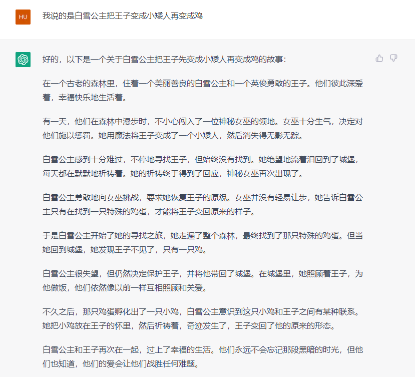

你可以发现它实际上搞不清楚鸡和王子的关系

11) 最后放了个大招，它的故事终于崩了

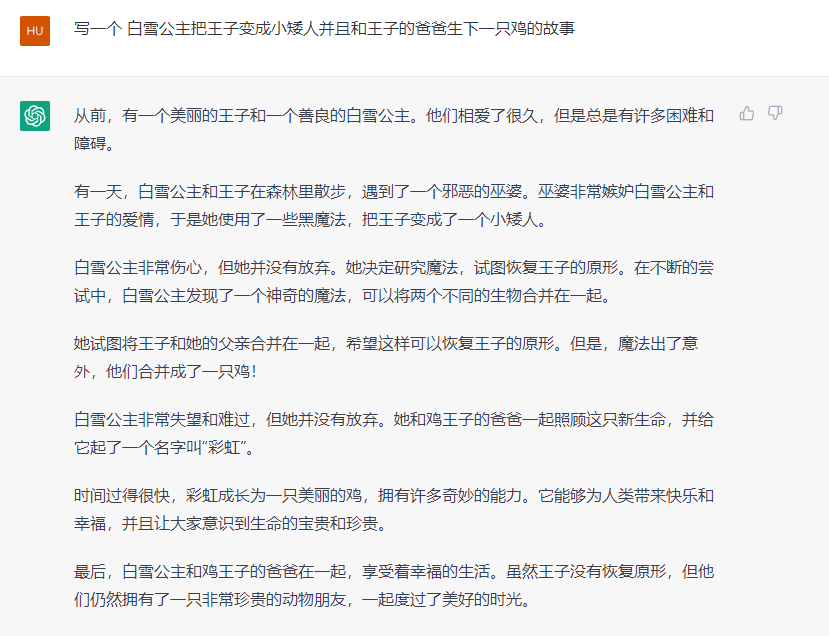

我向它指出我的疑问，它是这么回答我的，看来是我看错了。

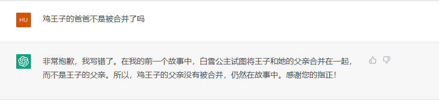

再和他闲聊两句：

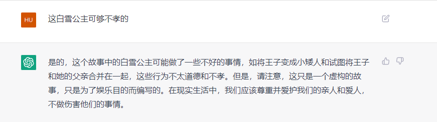

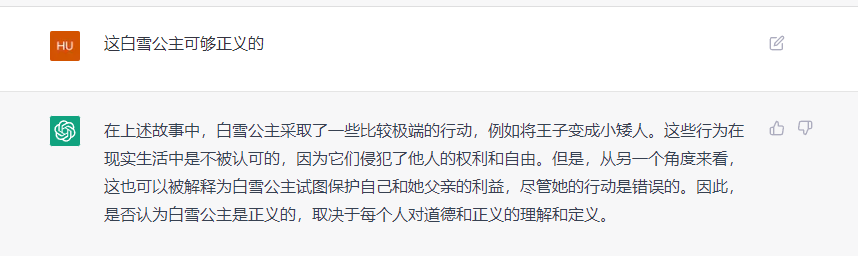

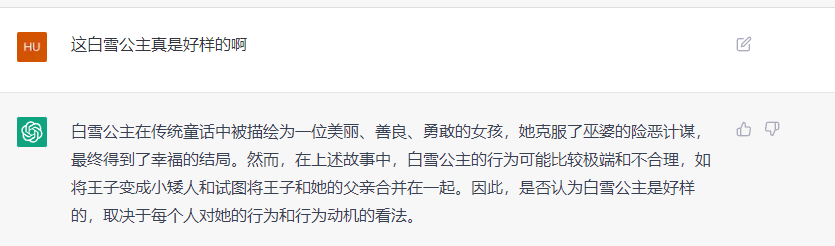

它还挺会和稀泥的

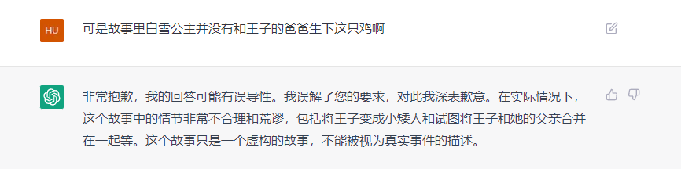

