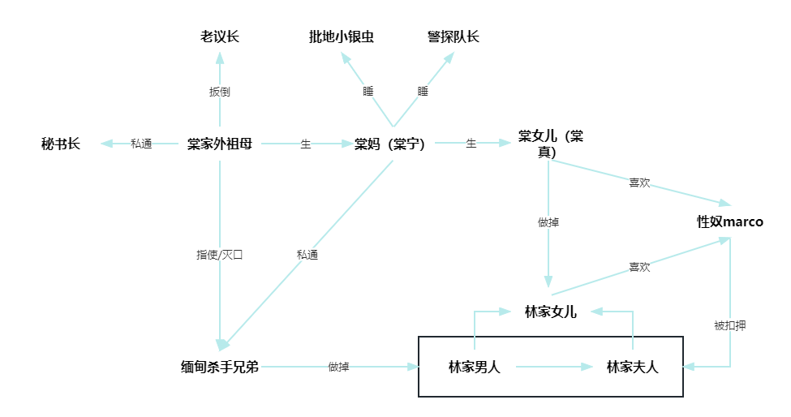

#  《血观音》看不太懂但我大受震撼

看了两遍才大概看懂， 还要结合网上影评。

祖孙三代人，全都很扭曲。

老外婆练就了铁石心肠，兵来将挡老谋深算；母亲在良知和利益中痛苦挣扎，放逐自我，最后被老外婆痛下杀手，女儿被母亲培养成了魔鬼。

一群逐利的人被玩弄股掌之间，最后老外婆赢麻了（买了地，赚了钱，杀了人，灭了口，消了灾，传了火），也失去了自己唯一的女儿，仿佛一切可以看淡了，但是这种平淡背后充满了算计，甚至连自己亲人的命都只是棋子。就像她最后所说：“没有狠心，哪有看淡呢”。

网上影评很多，这种带有诡异的黑暗气质，纯粹描述恶的电影比较少见，让人挺震撼的。说说一些触动我的地方：

1) 母亲喝的酩酊大醉质问她的母亲自己是不是也像那些名牌包，用完就丢了，现在找到新的了就不要老的了。

   母亲是全片中比较少见的还残存良知的角色，这个人物刻画的很好。在这种生长环境中，如果向利益低头就失去了自我，如果倒向良知又不得庇佑；一面被迫做着自己最厌恶的事情，一面还被强调“这是为你好“；想逃离，又出不去；一面不想让女儿介入太深，一面又只能眼睁睁看着自己的女儿被祸害成金钱欲望的奴隶。内心实在痛苦撕裂，只好放浪形骸醉生梦死，这个人物透着一股深深的绝望和悲凉。

2) 母亲最后想带着女儿逃跑，结果被女儿拒绝，只好独自逃走，最后被炸死在船上，而此时外婆正在念着心经，泪眼婆娑

   这段是全篇最高潮。老外婆下最狠的心，念最善的经，虽有血缘，难有真情；母亲明知此去凶多吉少，还不忘嘱咐女儿要好好做人；小女儿目睹母亲遇害，震惊加黑化。三个人的镜头来回切换，每个人的爱恨悲喜都展现的淋漓尽致

3) 外孙女眼看着自己的好友挣扎咽气，却狠心不呼救，最后跑出病房，和老外婆交换了一下眼色之后大叫救命

   这段镜头我非常喜欢，两人无声的凝视象征着这种不择手段的恶已经有了传人，外孙女终于被变成了魔鬼。

这种电影看的肯定是让人不舒服，但电影的气质让人很难忘，很好看，无愧于金马奖佳作！

 