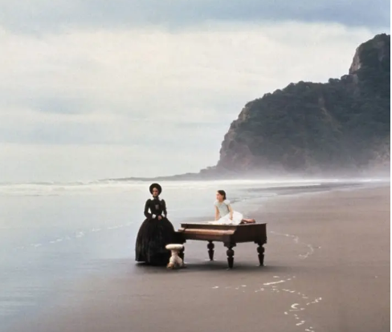
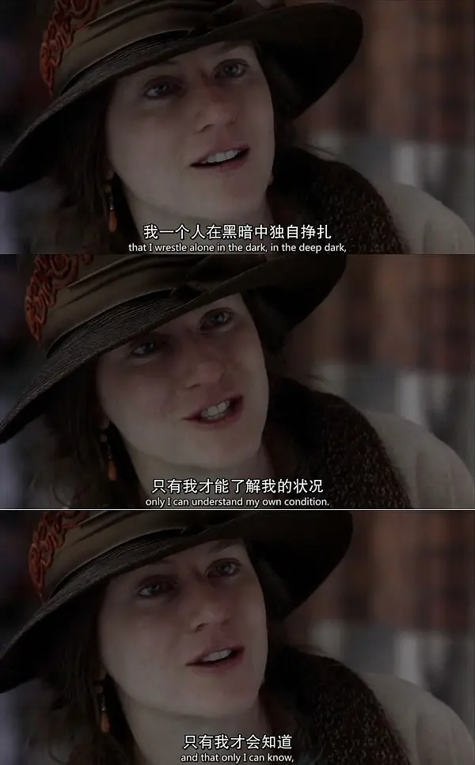
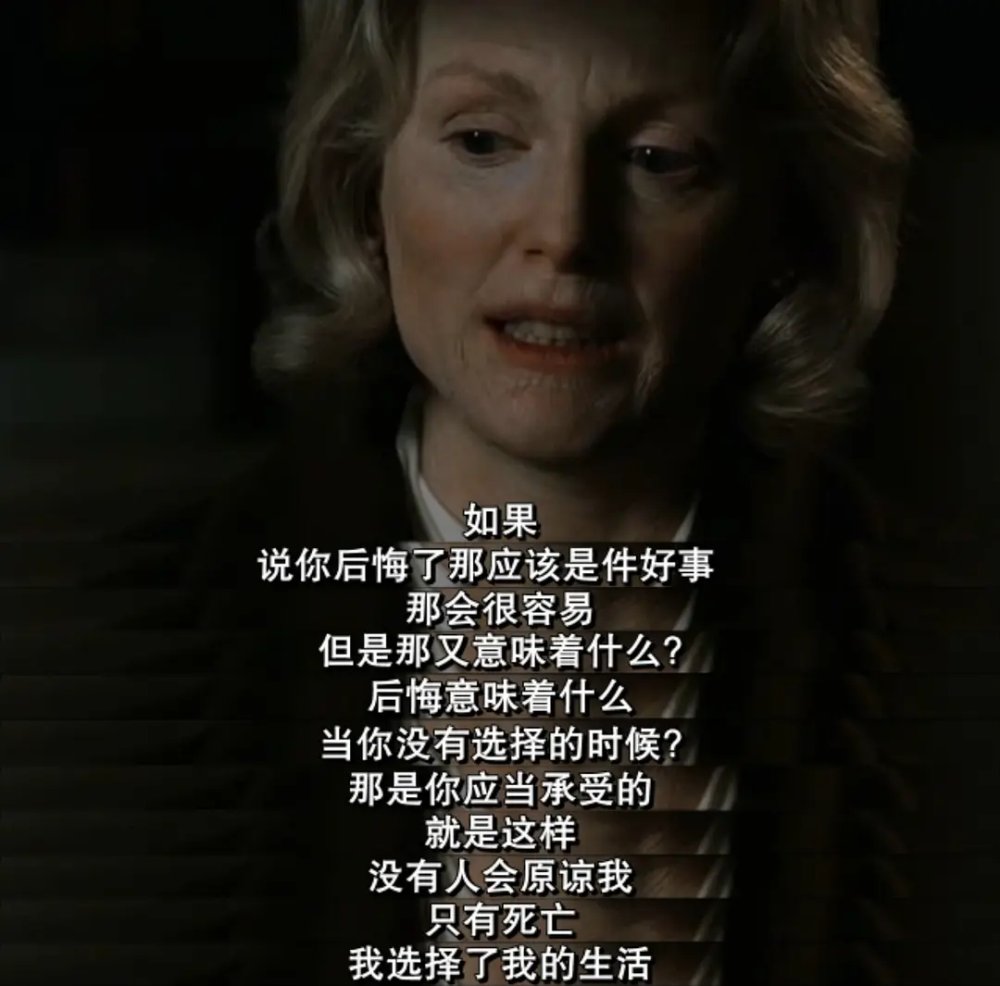

#  《钢琴课》《时时刻刻》

最近看了两部电影《钢琴课》 和 《时时刻刻》

电影内容就不介绍了，直接说下观感吧。 

《钢琴课》的音乐真好听，那首《the piano》直戳心灵。女主角抛却婚姻的枷锁，去追求自己的真爱，再抛却语言的枷锁（钢琴），去追求自己的人生，这是何等的勇气啊！

这种价值观可能国内的人难以理解，按照传统女性的观念来说，她老公也没有什么过分的表现啊，更没有虐待她啊，她就这样绿了她的老公，实在是有够作的。其实这就是价值观的不同，人的追求不仅是物质的丰腴，更有精神的愉悦、心灵的契合。在一段彼此都不相合的感情中，婚姻又何尝不是枷锁呢？ 所以我时常也自我反思， 是否会将另一半困在婚姻的枷锁中。在一段幸福的婚姻中，双方应是彼此滋养的，而不是彼此消耗的。

电影《时时刻刻》中，三个女人都在面对生活的平淡、琐碎、日复一日的时候采取了不同的态度，1923年的女人（后来看了介绍才发现那是妮可基德曼，气质太好了，她饰演的是著名女性作家伍尔夫）虽然知道自己离开宁静的乡野，走回喧嚣的伦敦可能会面临崩溃（她有精神疾病，太吵的环境下会幻听甚至想自杀），但是她毅然决然的回到了伦敦，最后在一次发病时自杀；1950年的女人面对生活的鸡零狗碎选择了逃离，留下了年幼的儿子和孤独的丈夫跑去了加拿大，但是她老来非常后悔， 她的行为也给自己孩子带来了心灵上不可磨灭的创伤。2001年的女人同样在面对生活的空虚、无意义感时，一度伤心落泪，但最后选择了坚强。

三个彼此独立的叙事之间有又关联，23年女人写了一本书被50年女人读到，50年女人是2001年女人前男友的妈妈。

每个人都需要问问自己： 自己最想要的究竟是什么？我们所拼命要打破的是否是我们最应该珍视的？

有些人早早的就明白自己想要什么，他们无疑是很幸运的，很多的人在拼命摆脱某种“苦难”之后又陷入另一个泥潭，总是不停的后悔，关键就是他们不知道自己想要什么， 而是只知道眼前的他们不想要。

年轻的时候看这些电影完全看不下去，因为根本不能理解，加上传统思想的影响，觉得片中的主人公都是“作”。但是随着年岁的增长我挺愿意看这些于无声处听惊雷的剧情片了。

世界上只有一种英雄主义：在认清生活真相之后依然热爱它。—— 罗曼罗兰

