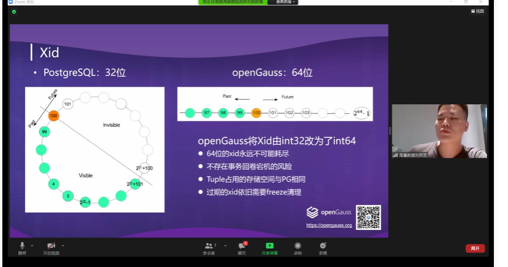

guassdb 

高性能   高可用  高扩展

Guassdb和 postgresql的差异

事务号Xid

openGuass改为了64位

怎么增加事务号长度的情况下， 保证元组空间不变， OpenGuass在页头增加了BaseXid（64位），记录了当前页开始的事务号，下面的Xmin， Xmax记录的都是偏移量， 这样把xmin 和 xmax的存储空间减少了。所以openGuass中Tuple占用的存储空间没有增加

待提交事务的序列号CSN

检查点 

PG检查点执行的时候会把buffer中所有脏页刷到磁盘。

openGuass增量检查点， 维护了一个脏页面队列。

