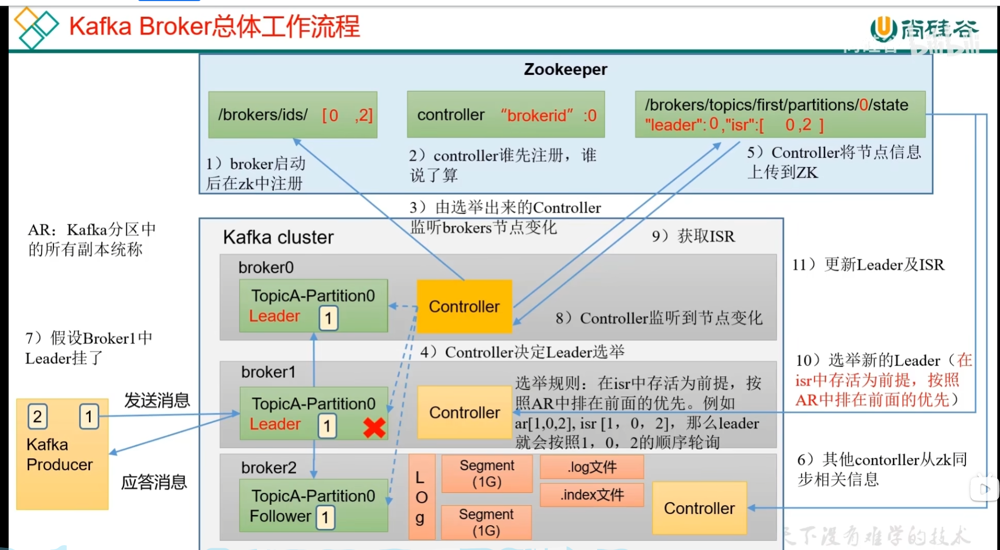

# Kafka学习笔记

参见视频：

https://www.bilibili.com/video/BV1vr4y1677k/

## 使用Kafka的场景

双11的这种场景下， 数据产生的速度大于 数据处理的速度， 所以需要先用kafka缓存下来。

## KAFKA的作用

1） 解耦： 不需要数据源和目的地之间建立联系， 只需要到kafka里面存取

2） 异步通信：先存下来， 再等到需要的时候再处理

## Kafka消息队列的两种模式：

一种是点对点模式，消费完就删除

一种是发布订阅模式，消费完不删除，其他消费者还可以继续消费

## KAFKA的基础架构

### 1） 分区（Partition）： 

一个TOPIC被分成了多个partition， 一个partition在一个机器（Broker）上

### 2） 消费者组（ConsumerGroup）： 

一个消费者组里面有多个消费者， 但是在消费者组中， 一个partition 只能被一个消费者消费

GPT Tips：

| GPT Tips：                                                   |
| ------------------------------------------------------------ |
| 在 Kafka 中，一个 partition 只能被一个 consumer group 中的一个 consumer 实例消费。这意味着同一个 consumer group 中的多个 consumer 实例可以分摊消费多个 partition，但一个 partition 只能由一个 consumer 实例消费。这种分配方式确保了在一个 consumer group 内的消费者实例之间的负载均衡，并确保每个消息只会被 consumer group 中的一个消费者实例处理。这样可以保证消息的顺序性和一致性。如果多个 consumer group 中的消费者实例订阅了相同的 topic，它们可以独立消费各自分配到的 partition。这样可以实现并行消费，提高整体的消费能力。需要注意的是，Kafka 中的 partition 是消息的物理分组单位，每个 partition 在任意时刻只能由一个 consumer 实例消费，但一个 consumer 实例可以同时消费多个 partition。 |

### 3） 有主备机制

 kafka集群中的partition有leader 和 follower

### 4） 部分数据存储在zookeeper

kafka2.8之后， 可以不用zookeeper ， zookeeper 已经成为kafka瓶颈

### 5） 整体功能三大块：

三块： producer （java）consumer （java）broker （scala）

## Kafka  Producer

### 基本架构

其中： 拦截器可用可不用（一般不用）， 序列化器进行序列化（如果是文本基本也用不到）。分区器中有个部分叫 RecordAccumulator ， 它是一个缓存（32M）每个批次是16k 这是一个双端队列。 这里也用到了内存池。 数据被缓存到这里面， 按批次进行缓存。**发送线程看到数据积累到batchsize之后， 才会发送数据。或者达到linger_ms也会发送**

发送的时候， 一个分区的数据以broker为key， 放到一个队列中，如图：

##### **TIPS：Sender 和 RecordAcumulator关系**

*在 Kafka 中，Sender 是负责将消息发送到 Kafka 集群的组件之一，而 RecordAccumulator 则是 Sender 内部的一个重要组件。*
*Sender 的主要作用是将消息从生产者发送到 Kafka 集群的 Broker。当生产者发送消息时，Sender 负责将消息添加到 RecordAccumulator 中进行缓冲和批量发送。*
*RecordAccumulator 是一个用于消息缓冲和批量发送的缓冲区。它接收来自生产者的消息，并按照指定的分区策略将消息累积到不同的分区中。同时，RecordAccumulator 会根据指定的时间、大小等条件进行消息的批量聚合，以减少网络开销和提高效率。*
*具体的工作流程如下：*

	1. *生产者发送消息：生产者将消息发送给 Sender。*
	2. *Sender 添加消息到 RecordAccumulator：Sender 将消息添加到 RecordAccumulator 中，根据消息的分区策略将消息放入对应的分区中。*
	3. *消息批量聚合：RecordAccumulator 在一段时间内（例如，一定时间间隔或达到一定消息数量）对消息进行批量聚合，以减少发送的网络开销。*
	4. *批量发送消息：当消息满足批量发送的条件时，RecordAccumulator 将批量消息发送给 Kafka 集群的 Broker。*
	5. *确认消息发送：一旦消息成功发送到 Broker，并收到 Broker 的确认响应（acknowledgment），Sender 将通知生产者消息发送成功。*

*通过使用 RecordAccumulator，Kafka 实现了高效的消息缓冲和批量发送机制。这样可以提高消息发送的吞吐量和效率，减少网络开销，并且允许更大的批量处理。*
*需要注意的是，RecordAccumulator 的配置参数可以根据具体的需求进行调整，以平衡延迟和吞吐量之间的权衡。*

#### 关于sender线程的个数：

在 Kafka 的 Producer 中，发送消息的工作由一个或多个 Sender 线程执行。具体有多少个 Sender 线程取决于配置参数和生产者的使用情况。

在 Kafka 0.8.x 版本中，每个生产者实例通常会有一个单独的 Sender 线程来处理消息的发送。这个 Sender 线程负责将消息从生产者的缓冲区发送到 Kafka 的 Broker。

从 Kafka 0.9 版本开始，引入了异步发送（Asynchronous Send）的机制，允许多个 Sender 线程并行地发送消息。这样可以提高生产者的并发性能和吞吐量。发送线程的数量可以通过配置参数 `max.in.flight.requests.per.connection` 来控制，默认值为 5。

需要注意的是，Sender 线程并不是一个固定的数量，而是根据配置和负载情况动态调整的。当生产者需要发送消息时，它会根据配置的参数和当前的负载情况动态创建或销毁 Sender 线程，以适应不同的生产者工作负载。

因此，具体有多少个 Sender 线程取决于 Kafka 版本、生产者的配置参数和使用情况。在生产者的工作中，可以通过适当的配置来控制 Sender 线程的数量，以满足性能和吞吐量的需求。

#### 应答机制

kafka集群收到之后有一个应答机制， 级别为0,1，-1

1）如果应答级别为0 ， 则不管成功与否继续发。

2） ack=1 leader 收到就继续发

3） ack=-1 或者 all 就意味着leader 和 follower 都收到之后才应答生产者客户端收到应答之后， 清理缓存和队列。 如果没有收到应答， 则继续发送。直到一定量（5个）的请求都没有收到应答为止, 如果一定时间还没有收到应答， 则retry

#### 三种发送方式：

1） 异步发送， 居多

2） 异步回调发送

有个callback

3） 同步发送

#### 分区

##### 分区的好处：

1） 便于合理使用存储资源， 实现负载均衡效果

例如： 磁盘1T, 100T 

2） 提高并行度， 生产者可以以分区为单位发送数据， 消费者可以以分区为单位消费数据

##### 分区方式

1） 指定分区

2） 没有partition但又key， 则hash再取余分区

3） 粘性分区

### 提高吞吐量的方法

1） 增加batch.size  批次大小， 默认16k

​        linger.ms 等待时间

2） compression.type 压缩snappy

3） RecordAccumulator 缓冲区大小 ， 修改为64M等

### 数据可靠性问题

##### 1） ACK=0， 很少使用

##### 2）ACK=1 ，  leader落盘就能应答

这种情况下， 有小可能会丢数据

##### 3） ACK=-1（all） 数据同步完再应答

Kafka  引入了ISR机制进行保护。

##### 数据完全可靠条件

### 数据重复问题

通过幂等性原理和事务来保证。

#### 1）幂等性原理

#### 2）事务

要使用事务功能，必须要开启幂等性

### 数据有序问题

数据有序的条件：

服务端重新排序：缓存请求个数小于5个，排序才有用。 会等到顺序请求都来了之后，才落盘。

下图中： req1 和 req2 先落盘， 然后等到3来了之后， 345 才会落盘

## Kafka Broker 

### zookeeper中记录的数据

可以看到zookeeper中存储的数据目录比较多。比较重要的就是：

1） ids ： 记录有哪些服务器

2） topics：  记录哪些服务器能用

3） controller ： 记录controller

其中， controller中的数据是用来做controller leader选举的， topics中的数据是用来决定某个partition leader选举的

### Kafka Broker整体工作流程

1） Broker启动之后， 会向zookeeper注册。

2） Controller谁先注册，谁说了算（先到先成为主controller）， broker0成为主controller

3） 选举出来的Controller监听Brokers节点变化

4） Controller决定Leader选举（图中的TopicA-partition0的 Leader选举）

5） 其他Controller同步相关信息。

6） 其他Controller从ZK同步相关信息

Broker1的Partition0接收数据，写文件

其他Broker从 Broker1的partition0同步数据， 是以LOG的形式进行同步的。

7） 假设Broker1中的leader挂了， 相应的zookeeper节点会发生变化（比如从ids中消失）

8） Controller监听到了节点的变化

9） 于是从ISR中获取当前的leader和 follower信息，发现当前挂掉的broker1是leader，需要进行leader选举

10） 选举新的leader，在isr中存活为前提， AR中排在前面的优先

11）更新leader以及ISR

#### TIPS： Kafka的Controller会监听哪些变化？

Kafka 的 Controller 是 Kafka 集群中的一个特殊节点，负责管理分区的分配、副本的分配和 Leader 的选举等关键任务。Controller 会监听 ZooKeeper 上的一些特定路径来检测集群状态的变化和执行相应的操作。

Controller 监听以下 ZooKeeper 路径上的变化：

1. `/controller`: Controller 会创建一个临时节点 `/controller`，并监听该节点上的变化。当当前的 Controller 节点发生故障或主动放弃控制权时，该节点会被删除，触发新的 Controller 选举。
2. `/brokers/ids`: Controller 会监听 `/brokers/ids` 路径上的子节点的变化，用于检测 Broker 的上线和下线。当新的 Broker 上线或下线时，Controller 会更新集群的元数据信息。
3. `/brokers/topics`: Controller 会监听 `/brokers/topics` 路径上的子节点的变化，用于检测主题的创建、删除和分区的变化。当有新的主题被创建或删除，或者现有主题的分区发生变化时，Controller 会相应地进行分区的分配和副本的分配。
4. `/admin/delete_topics`: 当管理员触发删除主题的操作时，Controller 会监听 `/admin/delete_topics` 路径上的变化。当删除主题的请求被创建时，Controller 会执行相应的主题删除操作。

通过监听这些 ZooKeeper 路径上的变化，Controller 可以及时感知到集群状态的变化，根据需要执行分区分配、副本分配、Leader 选举等操作，以保持 Kafka 集群的稳定和可靠运行。

### 节点的服役和退役

这个没什么好说的，看演示效果

### Kafka的副本

### Follower的故障处理

### Leader故障处理

leader故障之后， 会选出新的leader。 

但是新的leader可能会把其他follower已有的数据截断

能保证一致性，但是不能保证数据丢失

### 分区副本的分配

对于分区大于服务器数量的情况如何分配？ 

可以看到初始化的时候， leader和 follower的分配是错开的。尽量保证负载均衡

并且是按照一轮一轮的分配

### partition再平衡

一段时间之后会检查是否平衡， 超过阈值不平衡会再平衡

一般不建议开启再平衡， 会浪费带宽，性能开销大

### 增加副本因子

通过命令行可以增加副本

### Kafka文件存储

Kafka文件存储的方式， 三个文件

1） .log日志文件

2） .index偏移量索引

3） .timeindex時間戳索引

### 数据清理

