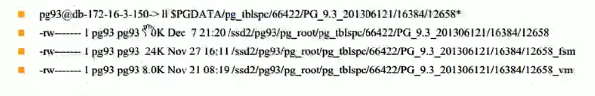
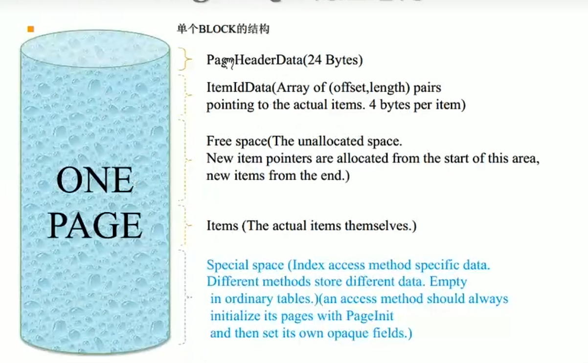
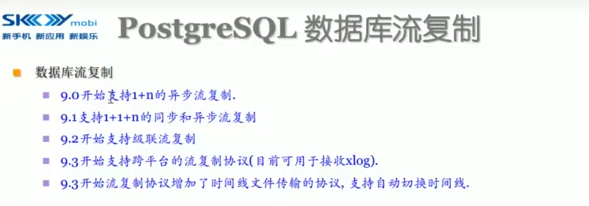
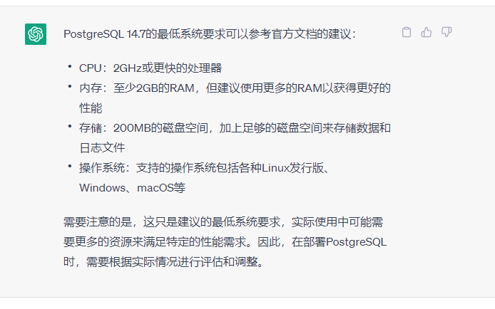

[toc]

# Postgresql原理学习

Postgresql原理学习建议看彭志勇的书以及Postgresql的官方文档：

现在Postgresql已经出到了14.7版本， 就以14.7版本作为蓝本学习吧。

参考教程：

https://www.bilibili.com/video/BV127411G7PX?p=6&vd_source=1115a1b57e46edddf88be0738ef3f5b2

德哥讲的非常好，本文只是对他讲述的一些摘要和补充

## 整体架构

cluster 是initdb之后完成的。 

连接一个数据库会

## 物理存储：

TODO： 

 table   toast  index  sequence

## 进程结构：

  

  

TODO： 什么是vacuum？？？

## 物理结构

### 整体结构

1、 表空间

2、 表空间OID， 实际上有个软链接

3、版本

4、数据库OID

5、FileNode OID  对应main Fork文件名。 其他Fork后面加后缀fsm、vm、init等等，超过1GB（编译时指定），后面加.x

#### 结构全景图

**你可以看到前面的索引指向的是后面的元组**

### 数据文件

一个表对应一堆数据文件。

每插入一个记录，就要看有没有数据块可以插入。

 

### 单个BLOCK的结构

1、 最上面是头

2、头下面是行索引

3、行索引下面有Free Space

4、行索引下面是items，它是从后向前分配的。

5、如果是个纯索引数据块，底层会有一部分 special space， 如果是表则这部分special space是没有的

#### block头

### 行数据结构

行数据结构是用tuple来表示的。

1、 行头部是23字节

2、只要有字段允许为空 就会有 null bitmap

3、padding 做一个存储对对齐

4、ObjectID

#### 元祖头

#### 元祖数据示意图

## 系统表

OID可能是一个隐藏字段

## 管理函数

### 信号发送

### 备份控制

### 恢复控制

### 数据库对象管理

主数据块  空闲空间，有脏数据就不在vm里面， 没有脏数据就在vm里面， 这样就减轻了 vacuum 进程的开销。

### 对象位置管理函数：

查看对象是存储在那个数据文件中的， 例如：

### 锁函数

PG使用多版本来做并发控制。减少锁冲突。  

### 文件访问函数

## 数据库可靠性（WAL/XLOG）

主要通过WAL来保证

注意 存储控制器的 write_cache通常有断电保护， 所以要打开， 但是硬盘cache一定要关掉。

### 一些数据库可靠性的配置

full_page_write 要打开

wal_level = archive 或 hot_standby

### HOT Update

数据更新之后， 索引不需要立刻更新， 直到vacuum之后才会更新索引。

#### 举个例子：

因为多次update，产生了很多版本

t_ctid指向了下一条被更新的记录

直到vaccum之后， 才会直接指向最后那条记录

## 事务和多版本并发

### tuple的 xmin  xmax 以及事务级别

对于read repeatable 的事务级别， 其XID比当前事务更早， 所以看不到未来的修改。

Postgresql不能看到未提交的事务对数据造成的变更， 只能看到已提交的数据。

CLOG的含义： 

| 在 PostgreSQL 中，clog 是指“commit log”，它是用于记录事务提交的状态信息的一种数据结构。具体来说，每当有一个事务提交时，clog 中就会相应地设置一个标志位，表示该事务已经提交成功了。这个标志位是基于事务的 XID（事务 ID）来设置的，因此每个事务都会有一个对应的 XID 和相应的 clog 标志位。在多版本并发控制（MVCC）机制下，PostgreSQL 可以同时支持多个事务对同一数据进行读写操作。因此，在事务提交时，必须保证对数据的修改是可见的，否则其他事务读取到的可能是旧版本的数据。而 clog 就是用来记录事务是否已经提交成功的标志位，从而在数据版本控制时起到重要作用。在 PostgreSQL 中，clog 通常和 pg_xact 目录一起使用。pg_xact 目录包含了所有活跃事务的信息，包括它们的 XID 和相关的状态信息。而 clog 则记录了所有提交过的事务的状态信息，用于支持数据版本控制。 |
| ------------------------------------------------------------ |

掩码： 

### 举例1

根据事务的隔离级别不同， 读到的数据不一样。

对于Read Repeated 这种隔离级别的事务， 他只能读到其他事务写之前的版本

 而Read Committed 这种级别的事务就要能读到新版本的数据 

再上述例子中 

1) RR1事务读到 tuple版本为v1

2) RC1事务读到也是 v1
3) RC2事务修改数据为v2，并且commit
4) RR1读到的还是v1
5) RC1读到的已经变成v2（因为RC1事务是读的commit的数据）
6) 新创建的RR2事务读到的版本是v2
7) RC3事务修改版本为v3，提交
8) RR1读到的还是v1
9) RR2读到的还是v2
10) RC1读到的已经变成v3

### 举例

1) 创建一个事务A, 是read repeated 级别， 读到数据为test

2) 再另一个事务B中 update 成 new 

3) 最后事务A读到的数据还是 test

   

## 数据库物理备份

还原点？？？？？

事务和XLOG之间的密切关系

## 数据库流复制

1+1+n   一个主节点， 一个同步standby 节点 ， n个异步节点

级联复制：  standby节点 再挂standby

我记得最关键的就是这个wal sender 和 这个 wal receiver

## 内存管理

内存管理，参见： 

Context本身是一个trunk， trunk里面又分了block。有freelist来管理当前空闲的block

freelist里面又会记录每种大小的block分别分配了多少

## 执行计划和代价估算

### 代价因子：

这个read可能来自 操作系统的的cache 也可能来自 硬盘。

### 做成本计算的一些依据

### Join

#### nestloop

nestloop就是全表扫描， 笛卡尔积了。

一般当join条件没有=关联的时候 容易出现。

#### HashJoin

什么时候适合hashjoin：

参见：

https://www.cybertec-postgresql.com/en/join-strategies-and-performance-in-postgresql/

可见：当表都不小，并且较小的表的hash表正好能装在work_mem中， 这样才能发挥作用，否则，hash桶就要放在磁盘了。

#### mergejoin：

可见使用场景是 内外部表都非常大， 并且hash桶都装不到workmem

如果有索引， mergejoin会非常快

mergejoin 的例子：

#### Semi Join 和 Anti Join

## 连接池和缓存

### 连接池

连接池的好处：

pg使用的是插件（extension） pgbouncer

### 高速缓存

高速缓存用的是 pgfincore

### 异地高速缓存

pgmemcache

## 分布式PL/Proxy  shard nothing 

## 回忆一下以前产品中用到了哪些PG能力：

1) 有用到插件   extension  foreign data wrapper 

2) 修改了查询编译器，修改了语法解析器和词法解析器   scan.l   gram.y ：   

1） 增加了语法  logic table 以及

2） 增加了send的能力。

3) 修改了pg_dump ， 需要支持逻辑表的备份和还原

4) 增加了系统表 logic table 

5) 修改了查询优化器， 主要修改了： 

   1） cost 代价估算

   2） 路由策略：    range路由策略 &  collocated join

6) 执行计划的反编译， 把执行计划转换为 相应数据源的SQL语言

7) 多进程执行 Hadoop 相关的查询 

   原先使用jni的能力发现不行，krb5.conf文件，有全局变量， 当访问两个Hadoop集群的时候会冲突， 只能采用多进程的方式， 每个读取要启动一个java进程，然后通过管道文件进行通信。

## Postgresql 14.7 最低配置要求

