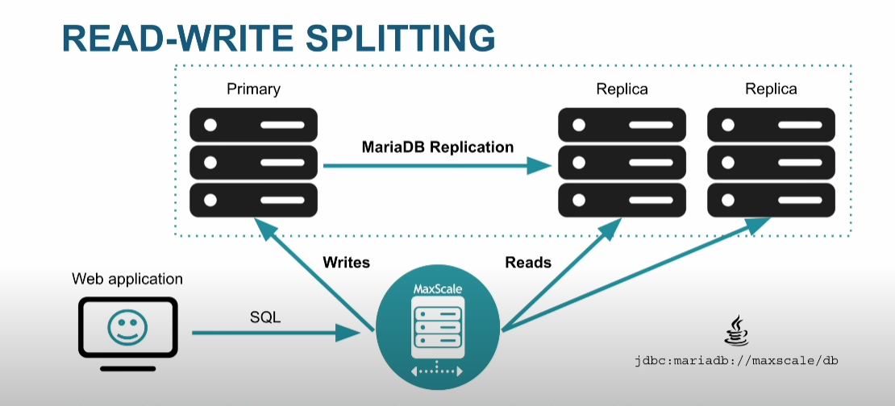
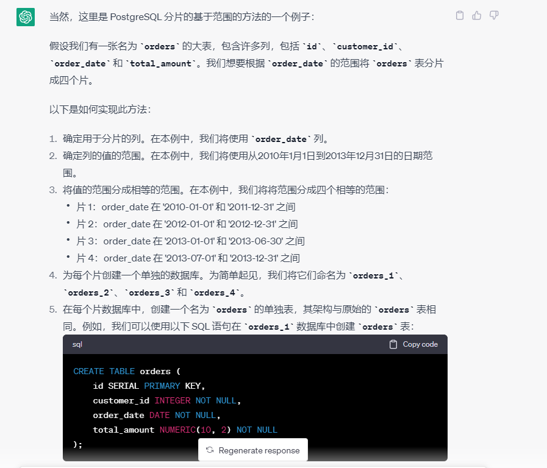
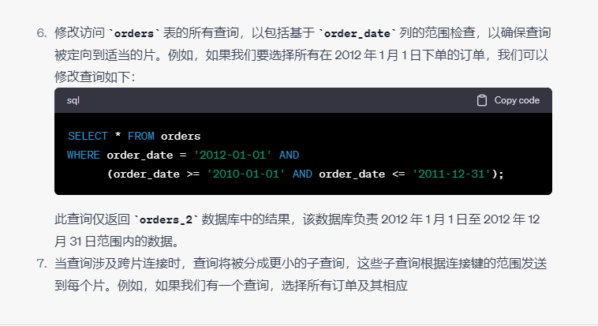
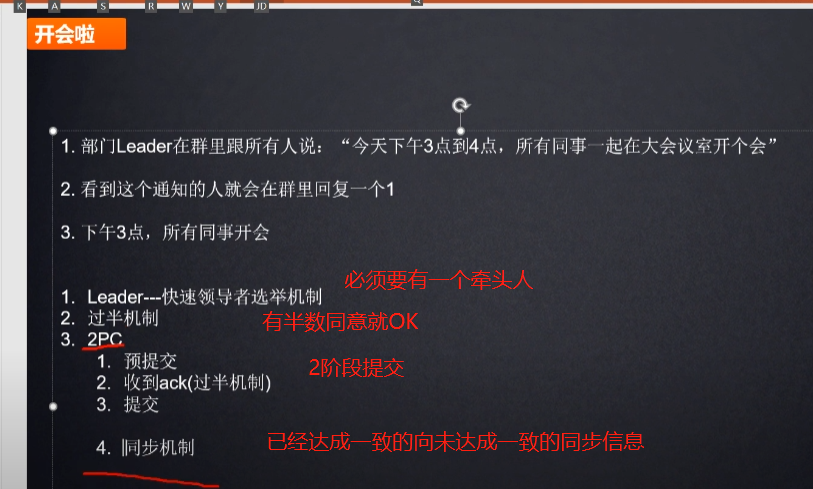

# 关于Shared Nothing （Sharding）

## 三种常见的分布式数据库构架设计架构：

主要有 Shared Everthting、Shared Nothing、和 Shared Disk：

1. Shared Everthting: 一般是针对单个主机，完全透明共享 CPU/MEMORY/IO，并行处理能力是最差的，典型的代表 SQLServer
2. Shared Disk：各个处理单元使用自己的私有 CPU 和 Memory，共享磁盘系统。典型的代表 Oracle Rac， 它是数据共享，可通过增加节点来提高并行处理的能力，扩展能力较好。其类似于 SMP（对称多处理）模式，但是当存储器接口达到饱和的时候，增加节点并不能获得更高的性能 。
3. Shared Nothing：各个处理单元都有自己私有的 CPU / 内存 / 硬盘等，不存在共享资源，类似于 MPP（大规模并行处理）模式，**各处理单元之间通过协议通信**，并行处理和扩展能力更好。典型代表 DB2 DPF 和 Hadoop ，各节点相互独立，**各自处理自己的数据，处理后的结果可能向上层汇总或在节点间流转**。
4. **我们常说的 Sharding 其实就是 Share Nothing 架构**，它是把某个**表从物理存储上被水平分割，并分配给多台服务器（或多个实例）**，每台服务器可以独立工作，具备共同的 schema，比如 **MySQL Proxy** 和 Google 的各种架构，只需增加服务器数就可以增加处理能力和容量。
5. Shared nothing 架构（shared nothing architecture）是一 种分布式计算架构。这种架构中的每一个节点（ node）都是独立、自给的，而且整个系统中没有单点竞争。
6. 在一个纯 Shared Nothing 系统中，通过简单地增加一些廉价的计算机做为系统的节点即可以获取几乎无限的扩展。
7. Shared nothing 系统通常需要将他的数据分布在多个节点的不同数据库中（不同的计算机处理不同的用户和查询）或者要求每个节点通过使用某些协调协议来保留它自己的应用程序数据备份 ，这通常被成为数据库 Sharding。

## Shared Disk架构

## Shared Nothing 所基于的理念：

参见：

https://www.youtube.com/watch?v=rlfdS34Y9fw

举例：TeraData

各自算各自的， 算完再开会

## 关于CAP原理

consistency （一致性） **, availability（可用性： 系统一直能提供服务）, and partition tolerance**（分区容错，分区之间如果出现数据差错还能否继续进行）.

分区容错意味着系统继续运行   分区容忍度的最简单示例是，即使参与提供服务的机器由于网络链接中断而失去相互通信的能力，系统仍继续运行

你会发现： 尤其是C和P是相矛盾的， 如果要高一致性， 那么对分区容错的容忍度就很小。

现在考虑两台服务器以主从关系协作的情况。两者都维护状态的完整副本，如果主服务器发生故障，从服务器将接管主服务器的角色，这是由心跳丢失决定的——也就是说，通常通过专用网络在两个服务器之间进行定期健康检查。如果两者之间的心跳网络被分区，slave会把自己提升为master，不知道原来的master已经up但是无法在心跳网络上通信。此时有两个主人，系统中断。这种情况称为**脑裂。**

SQL 和其他关系数据库使用术语**ACID**来描述它们在 CAP 三角形中的一侧。ACID 代表原子性（事务是“全有或全无”）、一致性（在每个事务之后数据库处于有效状态）、隔离性（并发事务给出与串行执行相同的结果）和持久性（已提交的事务的发生崩溃或其他问题时数据不会丢失）。提供较弱一致性模型的数据库通常将自己称为 NoSQL

不存在CA分布式数据库

完美的一致性 并不十分重要

mongodb  —— CP数据库， 是一个单主系统 ， 所以他保持一致性 ， 牺牲了高可用

Cassandra —— AP数据库。 宽列数据库， 无主架构

postgresql —— 单点的postgresql 是一个CP数据库

## SnowFlake的Shared Data（混合了SharedDisk 和 SharedNothing）

一些介绍SnowFlake的视频：

1）  https://www.youtube.com/watch?v=Vah_yweweso

实际上是通过一些巧妙的方法， 把数据scalable了， 然后存储在存储层。

这样他租用storeage的时候就非常便宜， 比如亚马逊的一些便宜的云服务器。

但是计算层在自己手里面，

表的存储结构：

计算单元是以warehouse的形式存在的， warehouse可以无限扩展，当需要查询的时候

Snowflake 数据仓库采用了一种云原生架构，它的架构设计旨在实现弹性、灵活和高性能的数据处理。以下是 Snowflake 数据仓库的主要架构组件和原理：

1. 虚拟数据仓库（Virtual Data Warehouse，VDW）：Snowflake 数据仓库采用多租户架构，在物理层面上共享基础设施资源，但在逻辑上分离为多个虚拟数据仓库。每个虚拟数据仓库具有自己的计算资源和存储空间，可以根据需求进行独立的扩展和管理。这种架构使得用户可以根据工作负载的需求灵活地调整计算资源，并实现高并发和隔离性。
2. 存储层（Storage Layer）：Snowflake 数据仓库使用了一种称为"存储服务"的对象存储解决方案（如 Amazon S3），用于持久存储数据。数据以列存储的形式存储，并采用高度压缩算法，以减少存储空间和提高查询性能。存储层是持久且可扩展的，允许数据的长期保存和管理。
3. 计算层（Compute Layer）：计算层是用于执行查询和数据处理的计算资源。当用户提交查询时，计算资源将被动态分配给虚拟数据仓库。Snowflake 数据仓库采用了一种称为"多重并行查询执行引擎"的技术，可以将查询分解为多个任务，并在多个计算节点上并行执行。这种架构实现了高性能的查询处理和弹性伸缩能力。
4. 元数据管理（Metadata Management）：Snowflake 数据仓库具有集中的元数据管理，用于管理表结构、列定义、索引信息和查询优化统计信息等。元数据管理包括数据字典、查询优化和执行计划等功能，以提高查询性能和优化资源利用。
5. 查询优化器（Query Optimizer）：Snowflake 数据仓库的查询优化器负责分析查询语句，并生成最优的查询执行计划。优化器考虑了数据分布、索引、数据压缩等因素，以最小化查询的运行时间和资源消耗。
6. 安全和访问控制：Snowflake 数据仓库具有严格的安全模型和访问控制机制。它支持多层次的安全控制，包括身份验证、授权和数据加密等。数据被保护在存储层和传输过程中，确保数据的机密性和完整性。

Snowflake 数据仓库的架构设计使其能够提供弹性和高可用性的数据处理能力。由于其云原生架构的设计，Snowflake 数据仓库能够根据工作负载的需求进行自动扩展和缩减计算资源，以满足用户的需求，并在后台处理系统维护和管理任务，减轻了用户的管理负担。

此外，Snowflake 数据仓库还提供了其他功能和特性，例如：

- 支持半结构化数据：Snowflake 数据仓库可以轻松处理半结构化数据，如 JSON、AVRO 和 XML 等。它能够自动解析和处理这些数据类型，使用户能够灵活地进行查询和分析。
- 时间旅行查询（Time Travel）：Snowflake 数据仓库提供了时间旅行查询功能，允许用户在不同时间点查询数据的历史状态。用户可以根据需要恢复数据，并对历史数据进行分析和比较。
- 数据分享（Data Sharing）：Snowflake 数据仓库支持安全和高效的数据共享。用户可以将数据集与其他 Snowflake 用户共享，而无需复制或移动数据。这样，不同的组织可以共享数据，实现数据合作和共同分析。
- 实时数据处理：Snowflake 数据仓库集成了实时数据处理功能，使用户能够处理流式数据和实时事件。它提供了与 Apache Kafka 等流式处理平台的集成，以实时地捕获、处理和分析数据流。

总体而言，Snowflake 数据仓库的架构设计旨在实现高性能、弹性和可扩展的数据处理。它通过将存储和计算层分离，采用云原生技术和多租户架构，为用户提供了灵活且成本效益的数据仓库解决方案。

### 多重并行查询执行引擎

Snowflake 数据仓库的多重并行查询执行引擎是其核心技术之一，它通过并行化和分布式执行查询，实现了高性能和弹性的查询处理。下面是多重并行查询执行引擎的主要实现方式：

1. 查询解析和优化：在查询提交到 Snowflake 数据仓库之后，首先进行查询解析和语法分析，以了解查询的结构和语义。然后，Snowflake 使用自己的查询优化器来生成最优的查询执行计划。查询优化器考虑了多个因素，例如数据分布、索引、数据压缩等，以选择最有效的查询执行策略。
2. 任务划分和分发：一旦查询被解析和优化，Snowflake 将其分解为多个任务，并根据任务的性质和数据分布进行划分。每个任务通常涉及一部分数据和计算，例如对一个数据块或一个分区的处理。这些任务被分发到不同的计算节点进行并行执行。
3. 数据分片和并行处理：Snowflake 数据仓库采用列式存储，将数据划分为多个数据分片，并将每个分片存储在不同的存储节点上。在查询执行过程中，每个任务只需处理其所需的数据分片，从而实现数据的并行处理。这种数据分片和并行处理的方式极大地提高了查询性能和吞吐量。
4. 动态资源分配：Snowflake 数据仓库根据查询的需求和系统资源的可用性动态分配计算资源。它会根据查询的复杂度和数据规模自动调整计算节点的数量和规模，以保证查询的高性能和可靠性。这种动态资源分配机制使 Snowflake 能够根据工作负载的需求实现弹性伸缩。
5. 任务协调和结果合并：在查询执行期间，Snowflake 的任务协调器负责监控和协调各个任务的执行。一旦所有任务完成，结果将被合并并返回给用户。这些结果合并后，可以进行进一步的数据转换、聚合或筛选，以生成最终的查询结果。

总的来说，Snowflake 数据仓库的多重并行查询执行引擎通过将查询分解为多个任务，并在多个计算节点上并行执行，以实现高性能和弹性的查询处理。该引擎结合了查询解析、优化、任务分发和并行处理等技术，使 Snowflake 能够处理大规模数据集和复杂查询，并实现高效的数据分析和查询性能

Snowflake 数据仓库的多重并行查询执行引擎与传统的分片（sharding）方式在数据处理和查询执行上存在一些关键的不同之处：

1. 数据分布和查询语义：传统的分片方式通常是基于数据分布的规则将数据划分为多个分片，并将每个分片存储在不同的节点上。查询在执行过程中需要明确指定目标分片，以定位和处理数据。而在 Snowflake 数据仓库中，数据分布和查询语义相对解耦。Snowflake 通过元数据管理和查询优化器，自动将查询分解为多个任务并并行执行，无需用户显式指定目标分片，使用户能够更专注于查询逻辑和业务需求。
2. 弹性和动态资源分配：传统的分片方式需要预先规划和分配资源，例如计算节点和存储容量，以适应数据增长和查询负载的变化。这种静态资源分配可能会导致资源浪费或不足的问题。Snowflake 数据仓库采用动态资源分配的方式，根据查询的需求和系统资源的可用性，动态分配计算资源。这使得 Snowflake 具有弹性和自适应的能力，能够根据工作负载的变化调整计算资源的数量和规模，以保证查询的高性能和可靠性。
3. 查询优化和任务协调：传统的分片方式通常依赖于应用程序或中间件来处理查询分片的路由和任务协调。这要求开发人员在应用程序中实现逻辑来管理分片和协调查询任务。而在 Snowflake 数据仓库中，查询优化器和任务协调器是内置的系统组件。查询优化器通过自动化的优化技术生成最优的查询执行计划，而任务协调器负责监控和协调各个任务的执行。这使得 Snowflake 在查询处理和任务管理方面具有更高的效率和灵活性。

总的来说，Snowflake 数据仓库的多重并行查询执行引擎通过自动化的查询解析、优化和任务协调，以及动态资源分配的能力，提供了与传统分片方式不同的数据处理和查询执行机制。它将用户从底层分片的细节中解放出来，实现了更高级别的查询抽象和资源管理，使用户能够更专注于查询逻辑和业务需求，同时提供了弹性、高性能和可靠性的数据处理能力。

# MySQL  Proxy

# MariaDB Proxy

参见：

https://www.youtube.com/watch?v=d9_gvEKy1MA

基本上是这么个架构。

可以直观的看到部署图：

### 读写分离

主备模式：

主备模式下， 读是到从节点， 写是写到主节点去。

### 通过proxy来做读写分离，对上层屏蔽

# Postgresql Proxy

postgresql的shared nothing 分区

## 原理

代理节点和节点支持无缝扩展

PlProxy做了一层抽象， 查询数据的时候， 调用PLProxy 写的函数

解析为提交给数据节点的SQL， 解析出来的SQL就交给数据节点执行，然后再返回给APP

## 几种运行模式

 旁路模式： 在PLProxy 中进行汇总，而不把函数下发给节点执行 

CLUSTER模式1： 配置存在SQL/MED配置的集群信息， 通过libpq_async API发送解析的SQL给数据节点（多个则并行）  等待所有数据节点返回结果给应用程序。

CLUSTER模式2： 和CLUSTER1的区别在于： 配置信息存在专门配置表。

## 关于连接池

1） plproxy 到数据节点为长连接， plproxy和数据节点之间一般可以不用连接池

2） 应用和proxy之间建议搞连接池

R_EXACT

R_ALL

R_ANY

R_HASH

参见： 

https://www.bilibili.com/video/BV127411G7PX?p=17&vd_source=1115a1b57e46edddf88be0738ef3f5b2

## postgresql怎么做分片运算

### 分片

#### Hash分片：

#### 范围分片

### Join的计算方式： 

#### broadcast join

当一张表比较小， 就可以广播

#### merge join 

#### distrubite Join

分布式join， 适用于

## 关于索引

是不是可以有反向索引？

## 哪些SQL语法在分布式数据库上运行效率高：

# Zookeeper

zookeepr保证最终一致性，尽量保证强一致性

怎么选出leader？ 

关键问题： 这个PK怎么实现

## zookeeper的脑裂问题

大集群， 因为网络断掉了出现了两个小集群，出现了脑裂。

出现脑裂问题非常严重。

如果是图上这样， 因为右侧只有两个节点， 选不出leader，所以右侧集群失效。

zookeeper通过过半机制解决脑裂问题： 要么有leader，要么没有leader，不会出现两个leader

为什么尽量用 奇数节点， 不要偶数节点？ 防止出现没有leader的情况

参见一下： 

https://www.youtube.com/watch?v=sRZOvIEX4xo

# Postgresql原理

### Join

#### nestloop

nestloop就是全表扫描， 笛卡尔积了。

一般当join条件没有=关联的时候 容易出现。

#### HashJoin

什么时候适合hashjoin：

参见：

https://www.cybertec-postgresql.com/en/join-strategies-and-performance-in-postgresql/

可见：当表都不小，并且较小的表的hash表正好能装在work_mem中， 这样才能发挥作用，否则，hash桶就要放在磁盘了。

#### mergejoin：

可见使用场景是 内外部表都非常大， 并且hash桶都装不到workmem

如果有索引， mergejoin会非常快

# Greenplum

