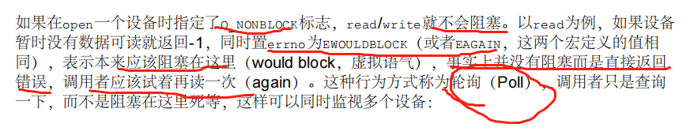
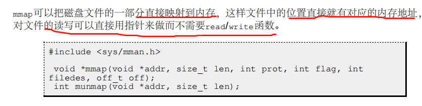
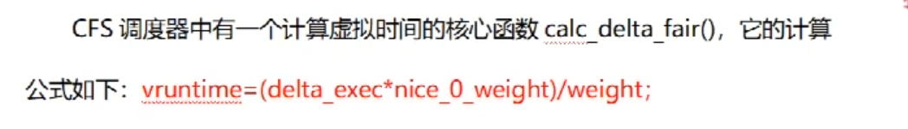

参考资料： 《linuxC一站式编程》  —— 非常好的资料

内核开发： https://www.bilibili.com/video/BV11W4y137Tj/?p=7&vd_source=1115a1b57e46edddf88be0738ef3f5b2

# **C开发相关知识**

## Short-circuit 和SideEffect

### SideEffect

在计算机编程中，Side Effect（副作用）是指表达式、函数或操作对程序状态产生的影响，超出了返回一个值的结果。C语言中的一些操作可能具有副作用，这意味着它们会修改程序的状态或与程序环境进行交互，而不仅仅是返回一个值。

以下是C语言中常见的具有副作用的操作：

1. I/O操作：包括读取和写入文件、终端输入输出等。这些操作会修改文件内容或与用户进行交互。
2. 修改变量的值：通过赋值操作、递增递减操作、位操作等修改变量的值会改变程序状态。
3. 函数调用：函数调用可能会修改参数的值、全局变量的值，或者执行其他具有副作用的操作。
4. 修改指针：在C中，指针的操作可能会修改指针所指向的内存内容，包括读取或写入数据。
5. 网络通信：进行网络通信时，例如发送和接收数据包，会与网络进行交互，从而改变程序的状态。

副作用在编程中是一种常见的概念，有时候是必要的，但也可能导致代码的可读性和可维护性降低。在编写C代码时，需要谨慎处理具有副作用的操作，并确保对程序状态的修改符合预期，并且不会产生意外的副作用。

避免Side Effect（副作用）在编程中是一种良好的实践，可以提高代码的可读性、可维护性和可测试性。以下是一些方法来减少或避免副作用的发生：

1. 函数纯度：尽量将函数设计为"纯函数"，即函数的输出仅依赖于输入参数，而不依赖于任何全局变量或外部状态。纯函数没有副作用，它的执行结果只取决于输入，使得代码更加可预测和可测试。
2. **显式参数传递**：尽量避免在函数内部直接访问全局变量，而是通过显式参数传递来获取所需的值。这样可以减少对外部状态的依赖，降低副作用的发生。
3. 封装状态：尽可能将状态封装在特定的数据结构中，通过严格控制对状态的访问和修改，避免直接对状态进行操作。这可以通过面向对象编程的封装特性实现，或者使用函数式编程中的不可变数据结构。
4. **限制全局变量**：减少使用全局变量，并尽量将其限制在必要的范围内。全局变量容易导致副作用的发生，增加代码的复杂性和不可预测性。
5. 函数命名和注释：清晰明确地命名函数和变量，并使用注释来描述函数的目的和预期行为。这可以帮助其他开发者理解代码的含义和作用，减少对副作用的误用和误解。
6. **单一责任原则**：将函数和模块设计为只负责单一的任务或功能。这有助于减少副作用的发生，使代码更加可读、可测试和可维护。

虽然完全避免副作用在实际编程中可能并不总是可行或合适，但通过以上方法可以最小化副作用的发生，提高代码的可靠性和可理解性。

写表达式应遵循的原则一：**在两个Sequence Point之间，同一个变量的值只允许被改变一次。**

仅有这一条原则还不够，例如a[i++] = i;的变量i只改变了一次，但结果仍是Undefined，因为

等号左边改i的值，等号右边读i的值，到底是先改还是先读？这个读写顺序是不确定的。

### Short-circuit ： 

&&运算与此类似，a && b的计算过程是：首先求a，如果a的值是假则整个表达式的值是假，不

会再去求b；如果a的值是真，则下一步求b的值作为整个表达式的值。所以，a && b相当于if

(a) b;，而a || b相当于“if (!a) b;”。这种特性称为Short-circuit，很多人喜欢利用Short

circuit特性使代码更加简洁。

## 结构体

结构体的填充和对齐

注意：如果是4字节对齐的，那么不到四个字节会填充

## 二维数组

二维数组在初始化的时候， 行可以省略， 但是列不能省略。

二维数组的存储： 

## gdb调试

# **C开发高级知识**

## 汇编语言和软中断

## ELF文件

## volatile 限定符

为什么要用volatile，因为防止缓存把寄存器当内存， 不能及时的获取数据的变化。

## 链接

### 程序的链接过程：

### 共享库：

## 宏定义

宏定义比函数的好处在于不要分配堆栈了。

### do while 0

为什么要用 do  while 0  就是为了防止分号的问题

### 内联函数

所以有了内联之后似乎可以不用#define了

### 宏展开（TODO）

### 一些特殊的宏（ \_FILE_   \__LINE__ 等）

## MakeFile

### 依赖关系

### 隐含的规则

## 函数接口

### 回调函数

### 可变参函数

主要通过几个宏进行操作

使用的时候，和printf是一样的。

## C标准库一些要点

1、内存操作 

memcpy： 拷贝n个字节

strcpy：      拷贝到\0

memmove： 比memcpy强在能处理重叠区域的拷贝，有自己的缓冲区，但是效率低

2、restrict关键字

3、比较字符串

4、字符串查找

5、字符串分割

### 标准库的IO缓冲区

### 内存分配函数

malloc  按照字节进行分配， 需要free

calloc： 按照元素个数和元素大小进行分配，并且初始化为0  所以如果需要初始化， 则需要用这个函数， 需要free

alloca： 这个在栈上分配内存，不需要free。

# linux C 编程

## 文件与I/O

### 库函数和系统调用的关系

标准C提供的fopen等函数， 内部提供了buffer

但是内核提供的open等函数没有， 他们是无缓冲I/O

1） **如果是读文件，建议用标准C的文件操作函数， 因为自带缓冲区**

2） 如果是网络编程，通常直接调用Unbuffered I/O函数

文件描述符存在一张表中

### 关于非阻塞：

非阻塞的缺点：

比非阻塞性能更好的那就是epoll机制，通过回调来快速通知和解决，而不是傻傻的循环。

### lseek

### fctrl

### ioctl

### mmap

## 文件系统

## 文件抽象层VFS

进程的PCB保存了一份文件描述符表，文件描述符就是这个表的索引，每个表项都有一个指向已打开文件的指针，现在我

们明确一下：已打开的文件在内核中用file结构体表示，文件描述符表中的指针指向file结构体

### 补充： 块设备和字符设备

linux中， 设备分为块设备和字符设备，字符设备就是一个字节一个字节读取的， 块设备就是一块一块的可以通过文件系统访问

### dup和dup2

## 进程

### fork

1. 父进程初始化。
2. 父进程调用fork，这是一个系统调用，因此进入内核。
3. 内核根据父进程复制出一个子进程，父进程和子进程的PCB信息相同，用户态代码和数据
也相同。因此，子进程现在的状态看起来和父进程一样，做完了初始化，刚调用了fork进
入内核，还没有从内核返回。
4. 现在有两个一模一样的进程看起来都调用了fork进入内核等待从内核返回（实际上fork只
调用了一次），此外系统中还有很多别的进程也等待从内核返回。是父进程先返回还是子
进程先返回，还是这两个进程都等待，先去调度执行别的进程，这都不一定，取决于内核
的调度算法。
5. 如果某个时刻父进程被调度执行了，从内核返回后就从fork函数返回，保存在变量pid中
的返回值是子进程的id，是一个大于0的整数，因此执下面的else分支，然后执行for循
环，打印"This is the parent\n"三次之后终止。
6. 如果某个时刻子进程被调度执行了，从内核返回后就从fork函数返回，保存在变量pid中
的返回值是0，因此执行下面的if (pid == 0)分支，然后执行for循环，打印"This is
the child\n"六次之后终止。fork调用把父进程的数据复制一份给子进程，但此后二者互
不影响，在这个例子中，fork调用之后父进程和子进程的变量message和n被赋予不同的
值，互不影响。
7. 父进程每打印一条消息就睡眠1秒，这时内核调度别的进程执行，在1秒这么长的间隙里
（对于计算机来说1秒很长了）子进程很有可能被调度到。同样地，子进程每打印一条消
息就睡眠1秒，在这1秒期间父进程也很有可能被调度到。所以程序运行的结果基本上是父
子进程交替打印，但这也不是一定的，取决于系统中其它进程的运行情况和内核的调度算
法，如果系统中其它进程非常繁忙则有可能观察到不同的结果。另外，读者也可以
把sleep(1);去掉看程序的运行结果如何。
8. 这个程序是在Shell下运行的，因此Shell进程是父进程的父进程。父进程运行时Shell进程
处于等待状态（第 3.3 节 “wait和waitpid函数”会讲到这种等待是怎么实现的），当父进程
终止时Shell进程认为命令执行结束了，于是打印Shell提示符，而事实上子进程这时还没
结束，所以子进程的消息打印到了Shell提示符后面。最后光标停在This is the child的
下一行，这时用户仍然可以敲命令，即使命令不是紧跟在提示符后面，Shell也能正确读
取

set follow-fork-mode child命令设置gdb在fork之后跟踪子进程（set follow-fork-mode

parent则是跟踪父进程）

### exec

### wait 和 waitpid

### 进程间通信的方式

#### 管道

#### FIFO文件（命名管道）

一个特殊文件， 指向内核中的一个队列。

不同于管道，FIFO是持久的，其他进程也能打开使用，而管道是临时的， 私密的（只能通信的进程之间用）。

#### Unix Domain Socket

使用最广泛的IPC， 和FIFO有点类似

## 信号

### 最常见的信号SIGINT

信号列表：

### 产生信号的条件

### 信号在内核中的表示

每个信号都有两个标志位分别表示阻塞和未决，还有一个函数指针表示处理动作。信号产生
时，内核在进程控制块中设置该信号的未决标志，直到信号递达才清除该标志。在上图的例子
中，

1. SIGHUP信号未阻塞也未产生过，当它递达时执行默认处理动作。
2. SIGINT信号产生过，但正在被阻塞，所以暂时不能递达。虽然它的处理动作是忽略，但在
    没有解除阻塞之前不能忽略这个信号，因为进程仍有机会改变处理动作之后再解除阻塞。
3. SIGQUIT信号未产生过，一旦产生SIGQUIT信号将被阻塞，它的处理动作是用户自定义函
    数sighandler。

### 信号处理函数的要求： 可重入

例如：

## 终端、作业控制、守护进程

### 终端读取的过程

### 终端登录的过程

### 网络终端登录过程

### Session和进程组

### 守护进程

创建守护进程的步骤： 

以下内容摘自：

https://www.bilibili.com/video/BV1SL411E77V/?spm_id_from=333.337.search-card.all.click&vd_source=1115a1b57e46edddf88be0738ef3f5b2

## 线程

### 线程的创建和终止

### 线程间同步：

#### mutex

#### 条件变量

#### 信号量

#### 读写锁

## TCP、IP协议基础

### tcpip基本

### IP数据报

#### 五类地址

#### 子网掩码

#### 环回地址（怎么环回的）

### UDP报文

### TCP协议

#### 三次握手

在数据传输过程中，ACK和确认序号是非常重要的，应用程序交给TCP协议发送的数据会暂存

在TCP层的发送缓冲区中，发出数据包给对方之后，只有收到对方应答的ACK段才知道该数据

包确实发到了对方，可以从发送缓冲区中释放掉了，如果因为网络故障丢失了数据包或者丢失

了对方发回的ACK段，经过等待超时后TCP协议自动将发送缓冲区中的数据包重发。

#### 四次挥手

#### 滑动窗口

## Socket编程

### TCP编程

### UDP编程

### **UNIX Domain Socket IPC**

# linux内核原理

## linux操作系统的启动过程：

## linux的同步管理

### 自旋锁

总结： 自旋锁忙等待， 可以用在中断调用，但是要求占有者使用时间短

### 互斥体MUTEX

linux内核中，有个类似信号量的实现，叫互斥体（mutex）。 并行处理环境中对多个处理器访问某个公共资源进行保护。

互斥锁比信号量实现高效

最先实现自旋等待机制

如何选择信号量、互斥体、自旋锁？  

**一般不选择自旋锁， 选择互斥体，其次信号量**

### 读写锁

允许多个线程并发访问临界区。读写锁能有效他提供并发性。

允许多个读者进入临界区， 同一刻写者不能进入。

### TIPS：

信号量、自旋锁、互斥锁、读写锁都是用来保证多线程或者多进程访问共享资源的同步机制。

- 信号量：用来控制多个进程或线程对共享资源的访问。主要有两个操作：P操作和V操作。P操作用于占用资源，V操作用于释放资源。可以用信号量实现互斥和同步。
- 自旋锁：自旋锁是一种基于忙等待的锁，在加锁时若发现锁已经被占用，就一直在原地忙等待直到锁被释放。自旋锁适用于临界区非常短的情况，因为长时间忙等待会消耗大量的CPU资源，导致CPU利用率降低。
- 互斥锁：互斥锁是一种阻塞锁，在加锁时若发现锁已经被占用，线程会被阻塞直到锁被释放。互斥锁保证同一时间只有一个线程访问共享资源，因此适用于临界区较长的情况。
- 读写锁：读写锁允许多个线程同时读共享资源，但是只允许一个线程写共享资源。**在加锁时分为读锁和写锁，读锁可以被多个线程同时持有，写锁只能被一个线程持有。适用于读多写少的场景。**

它们的异同点如下：

- 异同点1：在并发访问时，互斥锁和读写锁只允许一个线程访问共享资源，而信号量和自旋锁可以允许多个线程或者进程同时访问共享资源。
- 异同点2：自旋锁和互斥锁都需要在加锁和释放锁时进行系统调用，而信号量和读写锁可以不需要进行系统调用，从而提高性能。
- 异同点3：自旋锁适用于临界区非常短的情况，因为长时间忙等待会消耗大量的CPU资源，导致CPU利用率降低，而互斥锁和读写锁适用于临界区较长的情况。
- 异同点4：信号量和自旋锁可以用于实现互斥和同步，而互斥锁和读写锁只能用于实现互斥。

## Linux进程管理

### 进程优先级：

### 进程调度CFS

CFS (Completely Fair Scheduler) 是 Linux 内核中的一种进程调度器，它负责管理和分配 CPU 时间给各个运行的进程。CFS 的设计目标是公平地分配 CPU 时间，确保每个进程都能够按照其优先级和需求获得适当的时间片。

CFS 调度器的主要作用包括：

1. 公平性：CFS 通过使用红黑树数据结构来维护进程队列，并根据每个进程的虚拟运行时间来决定下一个运行的进程。它试图在多个进程之间公平地分配 CPU 时间，使得每个进程都有公平的机会获得执行时间，避免某些进程霸占 CPU 资源。
2. 实时性：CFS 为实时进程提供了足够的保证。它使用运行队列的虚拟运行时间来计算进程的优先级，并确保实时进程优先于普通进程获得 CPU 时间。这样可以满足实时进程对低延迟和响应性的要求。
3. 动态调整：CFS 根据系统的负载情况和进程的需求动态调整调度策略。它根据进程的优先级、虚拟运行时间和调度延迟等因素来调整进程的时间片大小，以适应系统负载的变化。
4. 周期性行为：CFS 提供了一种可以预测的周期性行为，它确保每个进程在一个时间窗口内获得公平的执行时间，这对于一些需要保持稳定性的应用程序是很重要的。

总体而言，CFS 调度器旨在提供一个公平、高效和可预测的进程调度机制，以优化多任务环境下的 CPU 利用率和系统响应性能。它是 Linux 内核中默认的进程调度器，并且在许多现代的 Linux 发行版中广泛应用。

#### CFS调度核心函数

vruntime ： 进程虚拟运行时间

delta_exec   实际运行时间

nice_0... nice 为0的权重值， nice值取值： 0-1024。 nice值越高， 对应的weight就越大

weight：  进程权重值

## linux内存管理

### slab结构

通过slab结构， 高效实现内存管理

### TIPS：

Slab 块管理器通过预分配和缓存对象的方式来高效管理内存，具体的机制如下：

1. 预分配内存：在系统初始化时，Slab 块管理器会预先分配一些固定大小的内存块（slab），每个 slab 都有固定的大小，并且能够容纳多个相同大小的对象。这些预分配的 slab 会根据对象大小进行分类，每个分类都有相应的 slab 列表。
2. 缓存对象：当需要分配对象时，Slab 块管理器会从相应大小的 slab 列表中查找是否有空闲的对象可用。如果有，直接从空闲列表中取出一个对象返回给请求者。
3. 对象分配：如果没有空闲对象可用，Slab 块管理器会从相应大小的 slab 中分配一个新的对象，并更新空闲列表。如果当前的 slab 已满，它会从内存池中获取一个新的 slab，再将新分配的对象返回给请求者。
4. 对象释放：当对象不再需要时，它会被返回给相应的 slab，并标记为可用状态，以便后续的对象分配。

通过这种预分配和缓存的方式，Slab 块管理器实现了以下几个方面的内存高效管理：

- 减少内存分配的开销：由于对象预分配和缓存的机制，分配对象时不需要频繁地从内存池中申请和释放内存，从而减少了内存分配的开销。
- 提高分配效率：相同大小的对象存储在相邻的内存块中，可以减少内存碎片，提高对象分配的效率。
- 提高访问局部性：相同大小的对象存储在相邻的内存块中，这样可以提高对象的局部性，减少了缓存失效的次数，提高了访问效率。
- 提高内存利用率：Slab 块管理器通过预分配固定大小的 slab，并将对象缓存在其中，避免了内存碎片的产生，提高了内存的利用率。

总体而言，Slab 块管理器通过预分配和缓存对象的方式，提高了内存分配和释放的效率，降低了内存碎片的产生，提高了内存的利用率，从而实现了高效的内存管理。

## 套接字和网络

内核中epoll的结构：

从这个结构中可以看到： 

1） 要给epoll创建一个fd。这个fd比较特殊， 它监听了一组套接字。 存在fds结构中

2） 红黑树是linux用来管理文件列表的，所有监听的套接字都在红黑树， 通过socket的fd可以查找到对应的文件详细信息。