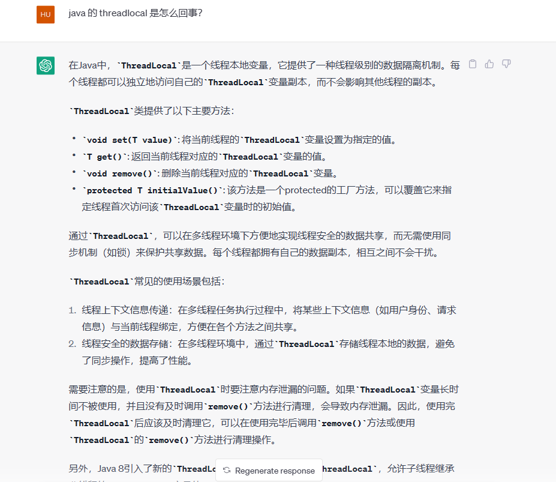

## 线程

### ThreadLocal：




下面是一个使用 `ThreadLocal` 的示例代码：

```
javaCopy codepublic class ThreadLocalExample {
    // 创建一个 ThreadLocal 变量
    private static ThreadLocal<String> threadLocal = new ThreadLocal<>();

    public static void main(String[] args) {
        // 在主线程设置 ThreadLocal 变量的值
        threadLocal.set("Main Thread Value");
        
        // 创建并启动一个新线程
        Thread thread = new Thread(new Runnable() {
            @Override
            public void run() {
                // 在新线程中获取 ThreadLocal 变量的值
                String value = threadLocal.get();
                System.out.println("Thread Value: " + value);
                
                // 在新线程中设置 ThreadLocal 变量的值
                threadLocal.set("Child Thread Value");
                
                // 再次获取 ThreadLocal 变量的值
                value = threadLocal.get();
                System.out.println("Thread Value: " + value);
                
                // 清理 ThreadLocal 变量
                threadLocal.remove();
                
                // 获取已清理的 ThreadLocal 变量的值
                value = threadLocal.get();
                System.out.println("Thread Value (after removal): " + value);
            }
        });
        
        // 启动新线程
        thread.start();
        
        try {
            // 等待新线程执行完成
            thread.join();
        } catch (InterruptedException e) {
            e.printStackTrace();
        }
        
        // 在主线程获取 ThreadLocal 变量的值
        String value = threadLocal.get();
        System.out.println("Main Thread Value: " + value);
    }
}
```

输出结果：

```
mathematicaCopy codeThread Value: Main Thread Value
Thread Value: Child Thread Value
Thread Value (after removal): null
Main Thread Value: Main Thread Value
```

在这个示例中，我们创建了一个 `ThreadLocal` 变量 `threadLocal`，然后在主线程中设置其值为 "Main Thread Value"。接着，我们创建了一个新线程，在新线程中获取并修改 `threadLocal` 的值。最后，在主线程中再次获取 `threadLocal` 的值。通过 `ThreadLocal`，每个线程都有自己独立的 `threadLocal` 变量副本，它们互不干扰。

需要注意的是，我们在新线程中调用了 `threadLocal.remove()` 来清理 `ThreadLocal` 变量。在示例的最后，我们再次获取 `threadLocal` 的值时会得到 `null`，因为它已经被清理了。


#### 如何使用弱引用来解决 `ThreadLocal`内存泄漏

使用弱引用来解决`ThreadLocal`内存泄漏问题是一种常见的做法。下面是使用弱引用来修复`ThreadLocal`内存泄漏的一种方法：

1. 自定义带有弱引用的`ThreadLocal`子类。

```
javaCopy codepublic class WeakThreadLocal<T> extends ThreadLocal<T> {
    @Override
    public T initialValue() {
        return null;
    }
    
    @Override
    public void remove() {
        super.remove();
        ThreadLocalHelper.remove(this);
    }
}
```

1. 创建一个辅助类`ThreadLocalHelper`来存储`ThreadLocal`实例的弱引用。

```
javaCopy codepublic class ThreadLocalHelper {
    private static final ThreadLocal<Set<ThreadLocal<?>>> threadLocalSet = new ThreadLocal<Set<ThreadLocal<?>>>() {
        @Override
        protected Set<ThreadLocal<?>> initialValue() {
            return new HashSet<>();
        }
    };
    
    public static <T> void remove(ThreadLocal<T> threadLocal) {
        Set<ThreadLocal<?>> set = threadLocalSet.get();
        set.remove(threadLocal);
    }
    
    public static void cleanUp() {
        threadLocalSet.remove();
    }
}
```

1. 在使用`ThreadLocal`的地方，使用`WeakThreadLocal`代替标准的`ThreadLocal`。

```
javaCopy codepublic class Example {
    private static final ThreadLocal<String> threadLocal = new WeakThreadLocal<>();

    public static void main(String[] args) {
        threadLocal.set("Value");
        
        // 使用 threadLocal 进行操作
        
        threadLocal.remove();
        
        // 程序结束前进行清理
        ThreadLocalHelper.cleanUp();
    }
}
```

通过使用`WeakThreadLocal`和`ThreadLocalHelper`，当`ThreadLocal`实例不再被使用时，其弱引用会被自动清理，避免了内存泄漏问题。在程序结束前，调用`ThreadLocalHelper.cleanUp()`来手动清理所有弱引用，以防止潜在的泄漏。

请注意，这种方法仅适用于当`ThreadLocal`实例不再被使用时，才能被垃圾回收。如果仍然有对应的线程存活，那么`ThreadLocal`的值仍然可用，因此在使用完`ThreadLocal`后，最好显式调用`remove()`方法或将其设置为`null`，以确保及时释放相关资源


示例：

下面是一个完整的示例，演示如何使用弱引用解决 `ThreadLocal` 内存泄漏问题：

```
javaCopy codeimport java.lang.ref.WeakReference;

public class WeakThreadLocalExample {
    // 自定义带有弱引用的 ThreadLocal 子类
    static class WeakThreadLocal<T> extends ThreadLocal<T> {
        private final WeakReference<ThreadLocal<T>> weakRef = new WeakReference<>(this);
        
        @Override
        public void remove() {
            super.remove();
            ThreadLocalHelper.remove(weakRef);
        }
    }
    
    // 辅助类，存储 ThreadLocal 实例的弱引用
    static class ThreadLocalHelper {
        private static final ThreadLocal<Set<WeakReference<ThreadLocal<?>>>> threadLocalSet = new ThreadLocal<Set<WeakReference<ThreadLocal<?>>>>() {
            @Override
            protected Set<WeakReference<ThreadLocal<?>>> initialValue() {
                return new HashSet<>();
            }
        };
        
        public static <T> void remove(WeakReference<ThreadLocal<T>> weakRef) {
            Set<WeakReference<ThreadLocal<?>>> set = threadLocalSet.get();
            set.remove(weakRef);
        }
        
        public static void cleanUp() {
            threadLocalSet.remove();
        }
    }
    
    private static final ThreadLocal<String> threadLocal = new WeakThreadLocal<>();

    public static void main(String[] args) {
        threadLocal.set("Value");
        
        // 使用 threadLocal 进行操作
        System.out.println(threadLocal.get());
        
        threadLocal.remove();
        
        // 程序结束前进行清理
        ThreadLocalHelper.cleanUp();
    }
}
```

在这个示例中，我们创建了一个自定义的 `WeakThreadLocal` 类，它继承自 `ThreadLocal`，并在其内部使用了一个弱引用 `WeakReference<ThreadLocal<T>>`。我们还创建了一个辅助类 `ThreadLocalHelper`，用于存储 `ThreadLocal` 实例的弱引用。

在 `main` 方法中，我们创建了一个 `threadLocal` 实例，并将其设置为 "Value"。然后，我们使用 `threadLocal.get()` 来获取该值并打印输出。最后，我们调用 `threadLocal.remove()` 来移除该值，并在程序结束前调用 `ThreadLocalHelper.cleanUp()` 进行清理操作。

通过使用 `WeakThreadLocal` 和 `ThreadLocalHelper`，当 `ThreadLocal` 实例不再被使用时，其弱引用会被自动清理，避免了内存泄漏问题。在程序结束前，我们通过调用 `ThreadLocalHelper.cleanUp()` 来手动清理所有弱引用，以防止潜在的泄漏。

请注意，为了简化示例，省略了异常处理和线程间的并发访问问题。在实际应用中，需要根据具体情况进行适当的处理。