## TCP相关知识总结

参考教程：

### TCP网络分层

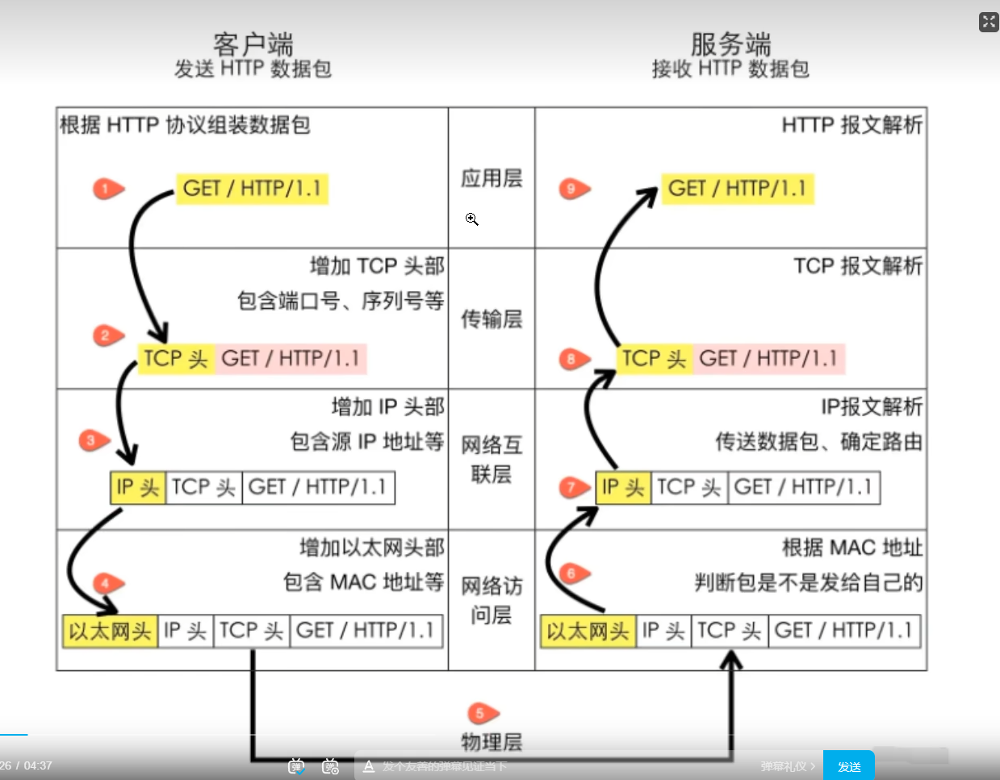

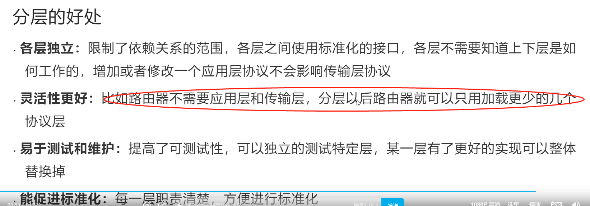

### 建立连接三次握手

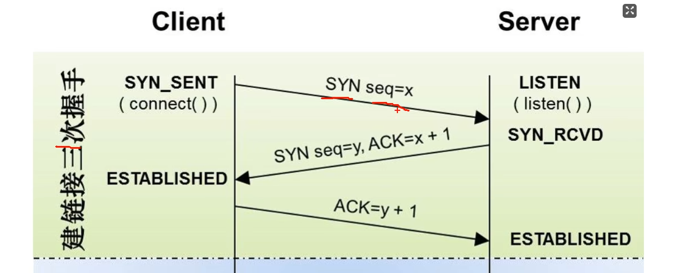

三次握手： 

1） 第一次，client端发一个序列号x

2） 第二次， server返回y，x次数加1

3） 第三次， client确认， ACK=y+1

如果只握两次，无法确认客户端能力

如果握4次，浪费资源

### 数据传输

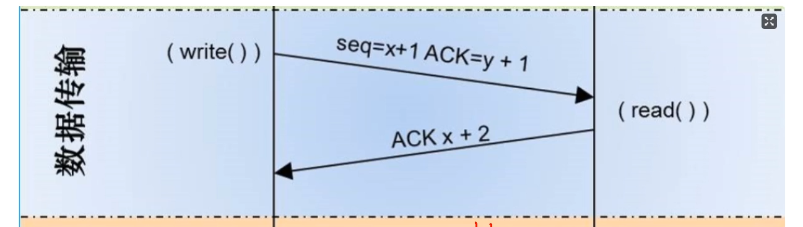

### 断开连接四次挥手

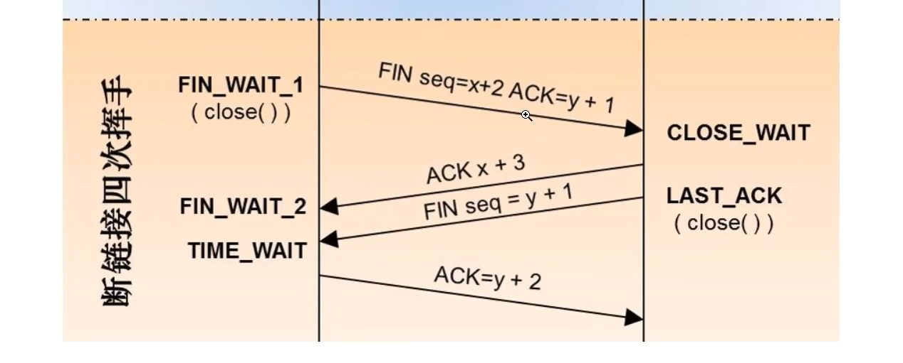

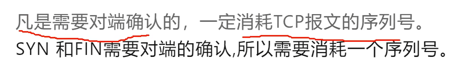

为什么ACK和FIN要分开发送。

因为存在延迟

四次挥手的原因如下：

1. 客户端发送关闭连接请求：当应用程序决定关闭连接时，客户端发送一个带有 **FIN（Finish）标志的TCP段给服务器**，表示客户端不再发送数据。
2. 服务器确认关闭请求并发送数据：服务器接收到客户端发送的 FIN 段后，会发送一个 ACK（Acknowledgment）段作为确认，同时继续发送剩余的数据，直到服务器准备好关闭连接。
3. 服务器发送关闭连接请求：服务器完成数据发送后，**会发送一个带有 FIN 标志的段给客户端**，表示服务器不再发送数据。
4. 客户端确认关闭请求并关闭连接：客户端收到服务器发送的 FIN 段后，发送一个 ACK 段作为确认，并进入 TIME_WAIT 状态。在 TIME_WAIT 状态持续一段时间后，客户端关闭连接。

四次挥手的目的是确保双方都能安全、可靠地关闭连接。每一方都需要发送一个 FIN 段和接收对方的确认（ACK），以确保数据的完整性和可靠性。同时，四次挥手还可以处理网络中可能存在的延迟、重复和失序的数据段。

在四次挥手过程中，需要经历一定的时间延迟和网络交互，以确保数据的正确关闭**。TIME_WAIT 状态的持续时间（通常为几分钟）是为了处理可能仍在网络中的滞留数据段，以免在新的连接中产生混淆。**

需要注意的是，四次挥手的过程中，如果某一方长时间没有收到对方的确认（ACK），则会进行重传，以确保连接的可靠关闭。

### 半连接队列和SYN Flood

半连接队列就是收到了SYN， 但是没有收到后续的， 占用了连接

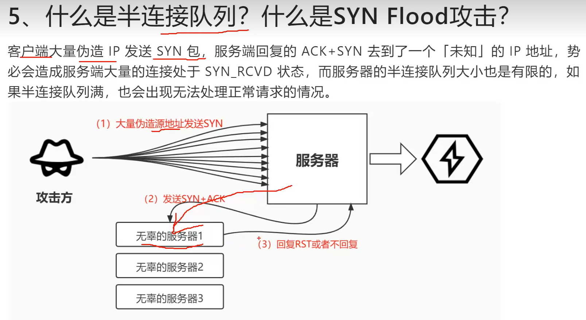

以下是一些防范SYN Flood攻击的常见措施：

1. 配置防火墙：使用防火墙来限制对目标系统的连接请求，例如限制每秒钟接收的SYN请求的数量。
2. 启用SYN Cookie：SYN Cookie是一种用于防范SYN Flood攻击的技术，可以在服务器端启用。它通过在SYN-ACK响应中使用加密的Cookie信息，而不在服务器端维护连接状态，从而防止资源耗尽。
3. 调整TCP参数：可以调整操作系统的TCP参数，例如增加连接队列的大小、减少SYN-ACK重传次数、减小SYN超时时间等，以增强系统的抵御能力。
4. 使用反向代理：使用反向代理可以将客户端请求分散到多个后端服务器上，分担每个服务器的负载，从而减轻单个服务器受到SYN Flood攻击的影响。
5. 使用入侵检测/防御系统（IDS/IPS）：使用IDS/IPS系统可以监测并及时响应SYN Flood攻击，例如通过检测异常的SYN连接行为并自动封锁攻击源。
6. 流量清洗服务：使用专门的流量清洗服务提供商，这些服务提供商可以识别和过滤掉恶意流量，以确保合法流量能够到达目标系统。
7. 网络负载均衡：使用网络负载均衡设备可以将流量分散到多个服务器上，使每个服务器能够处理更少的连接请求，从而减轻SYN Flood攻击的影响。

除了上述措施，定期更新和维护系统、监控网络流量、使用入侵检测系统等也是重要的防范措施。组合使用多个防御手段可以提高系统的安全性，抵御SYN Flood攻击和其他网络攻击。

### TCP超时和重传

TCP的重传和超时规格是根据具体实现和操作系统的配置而有所差异，但通常遵循以下一般规则：

1. 超时时间（Timeout）：
   - TCP使用超时时间来确定在没有收到确认（ACK）的情况下重传数据的时间。
   - 超时时间通常是根据网络状况和延迟进行动态调整的，以平衡可靠性和性能。
   - 初始超时时间通常较短，例如几百毫秒，然后会根据网络情况进行自适应调整。
2. 重传机制：
   - 当发送方发送一个数据段后，它会等待一段时间来接收对应的确认（ACK）。
   - 如果在超时时间内没有收到确认，发送方会假设数据丢失，并重新发送相同的数据段。
   - 重传的次数通常是有限制的，超过一定次数仍未收到确认则认为连接或数据出现了问题。

需要注意的是，具体的重传和超时规格可以根据实际的TCP实现和配置进行调整。在实际应用中，操作系统和网络设备的配置参数可能会影响重传和超时规格。此外，TCP的各个实现也可能具有不同的**算法和策略**来处理超时和重传。

对于具体的TCP实现和操作系统配置，您可以参考相关文档、文献或官方指南，以了解更详细和具体的重传和超时规格。

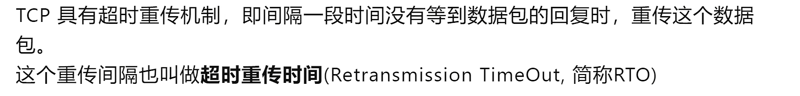

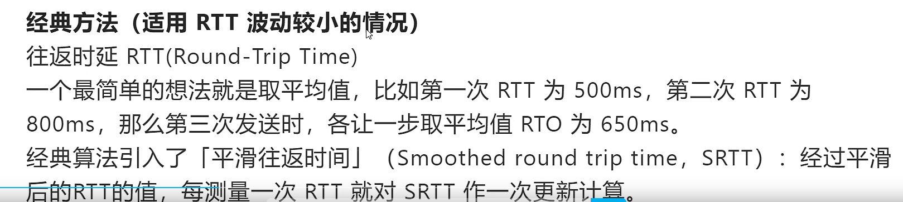

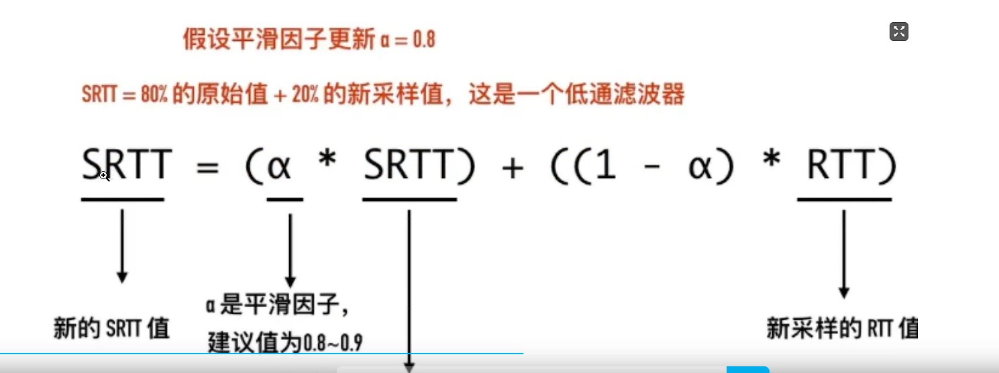

### TCP流量控制

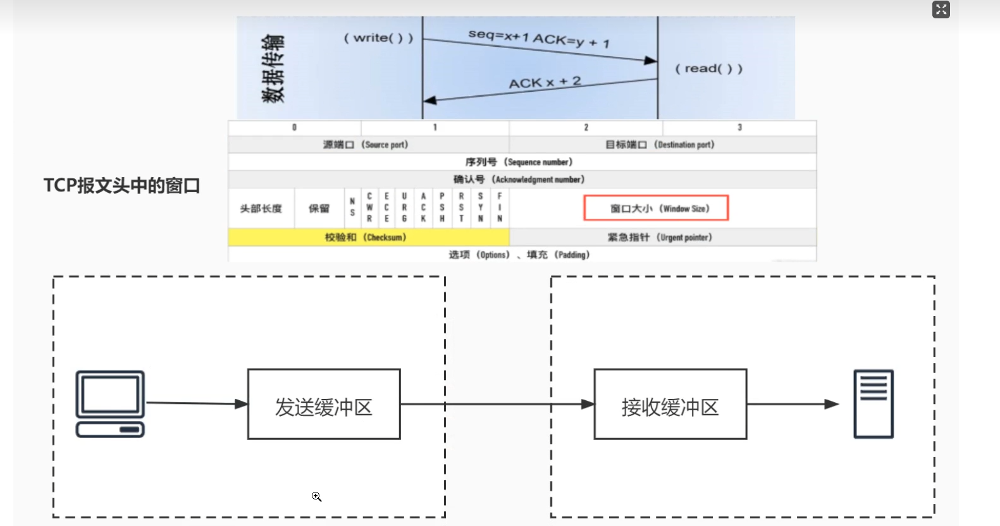

窗口大小就是用来做流量控制的。

### Keep-Alive

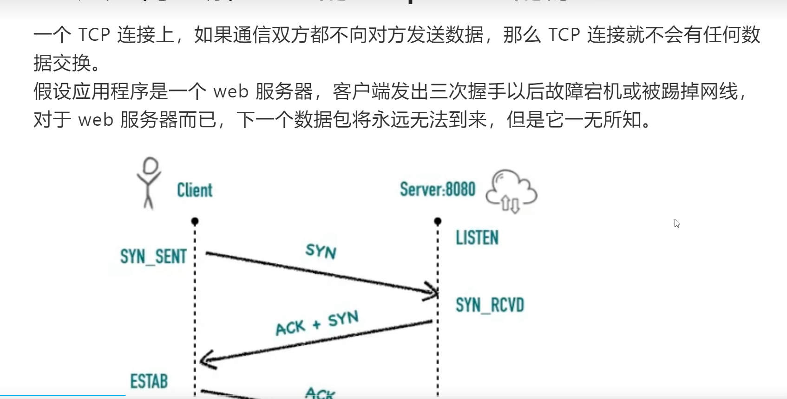

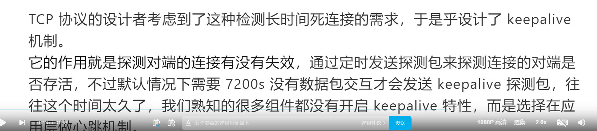

### TCP中的端口号

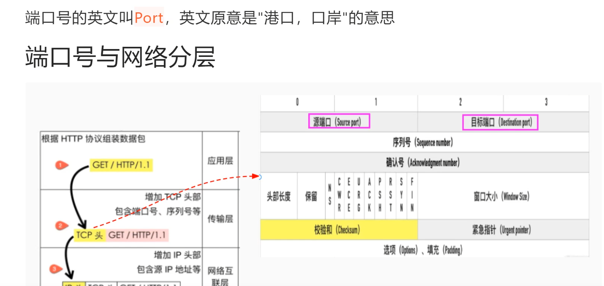

### TCP Fast Open

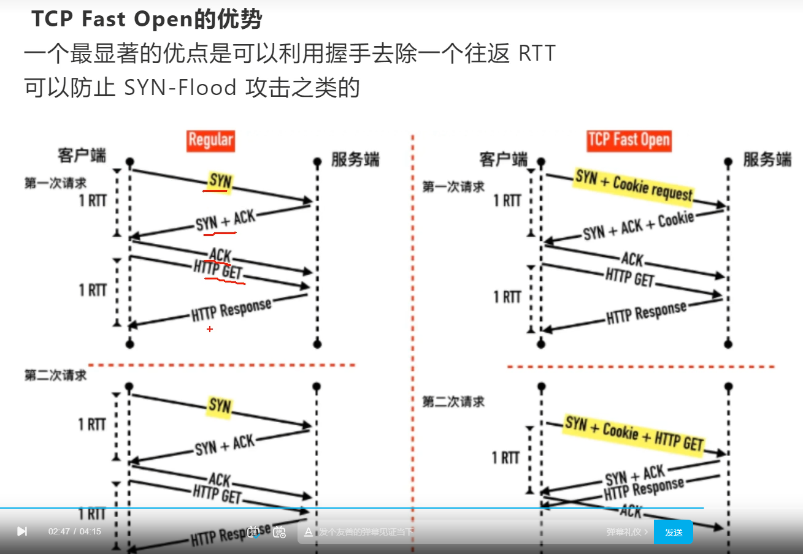

下面是对TCP Fast Open的理解：

1. 加快连接建立速度：传统的TCP连接需要进行三次握手，即客户端发送SYN，服务器回复SYN-ACK，最后客户端回复ACK。这个过程需要往返的延迟，而TFO通过在初始握手的SYN段中携带应用层数据，使得服务器在收到SYN时就可以开始处理数据，从而加快连接建立的速度。
2. 需要支持：TFO需要客户端和服务器都支持该功能才能生效。客户端和服务器可以通过在TCP选项中设置相关标志来表明支持TFO。
3. 安全性考虑：由于TFO允许在初始握手中发送数据，这可能会引发一些安全风险。因此，TFO需要在可信任的网络环境中使用，以防止恶意的数据注入。通常情况下，TFO在已建立过安全连接的客户端和服务器之间的再次连接时才被启用。
4. 适用场景：TFO特别适用于需要频繁进行短连接的应用，例如网页浏览、移动应用等。通过减少握手延迟，可以显著提升用户体验和应用性能。

需要注意的是，TFO在实际使用中可能会受到网络和操作系统的限制。不同操作系统和网络设备对TFO的支持程度可能有所差异，因此在使用TFO时需要进行相应的配置和测试，以确保正常运行和预期的效果。

总而言之，TCP Fast Open通过在初始握手中携带数据，减少了握手的往返延迟，从而加快了TCP连接的建立速度。它是一种有效的优化机制，可用于改善特定场景下的网络性能和用户体验。

### TCP报文

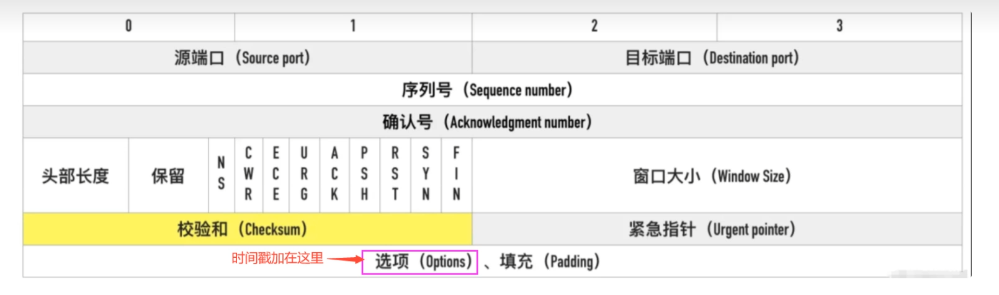

### TCP场景问题1

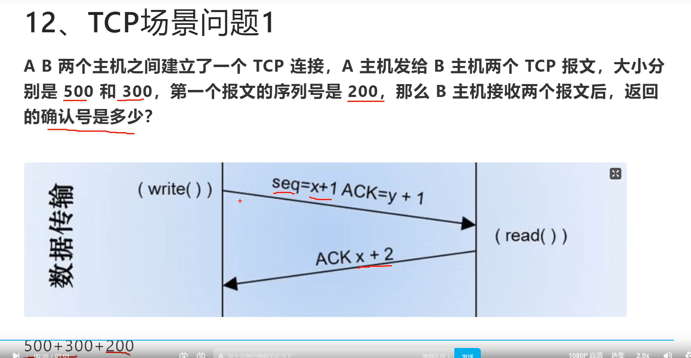

收到两个报大小  再加上请求序列号  就是返回的序列号

### 怎么区分TCP和UDP

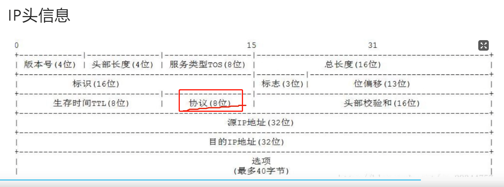

### TCP场景问题3

应用的记录标识

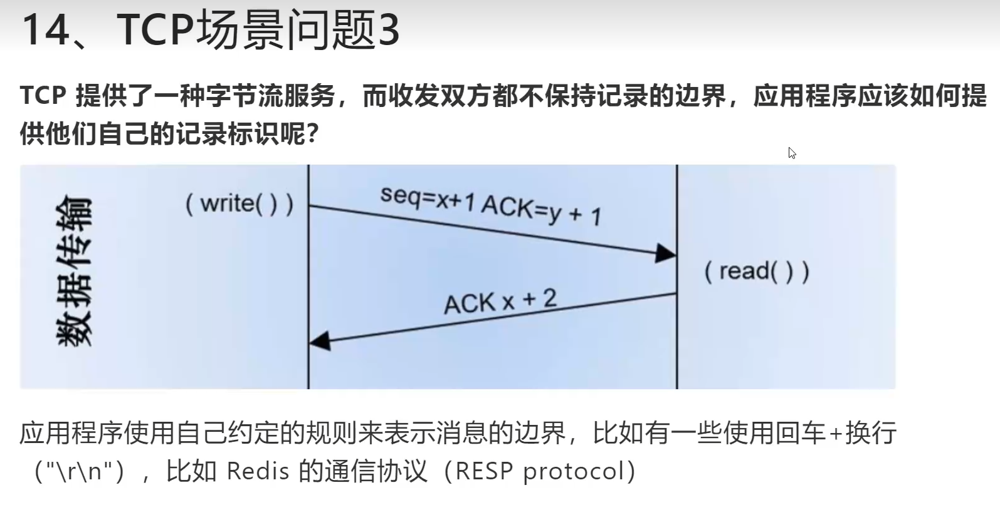

### telnet的用法

一般用来检查端口是不是打开

### tcpdump 和 WireShark

抓包工具 和 抓包分析工具

### TCP和UDP的区别

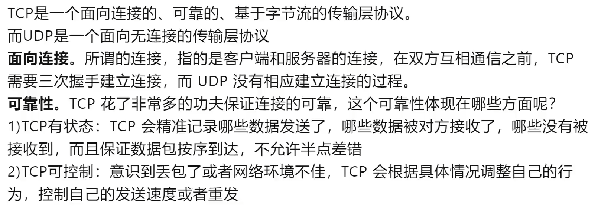

