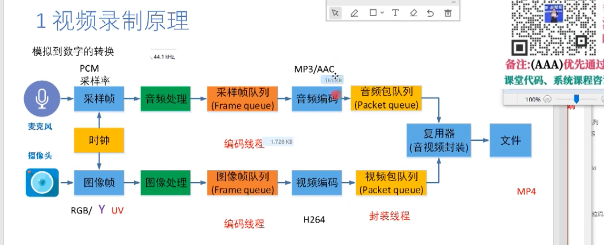
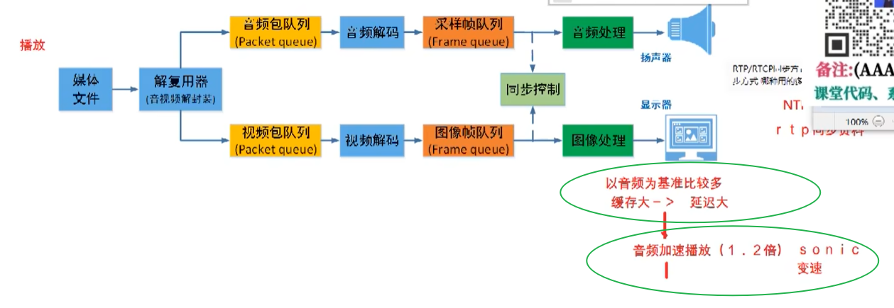
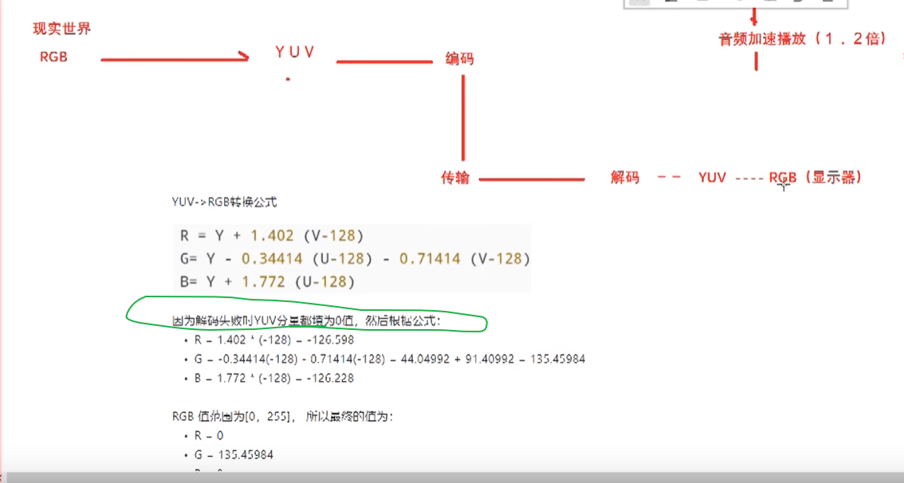
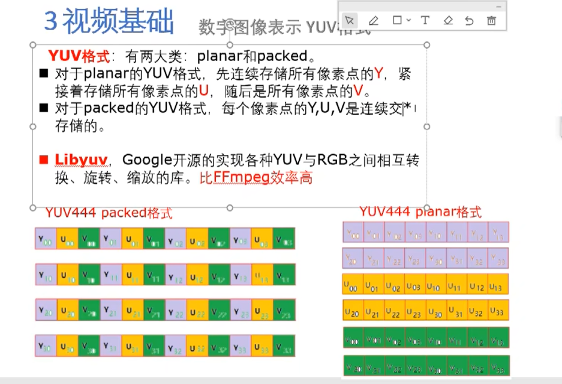

# 音视频编程学习

参见：  https://www.bilibili.com/video/BV1oM4y1S7ji/?spm_id_from=333.337.search-card.all.click&vd_source=1115a1b57e46edddf88be0738ef3f5b2

## 基础知识

奈奎斯特采样定理： 如果信号最高频率是20KHz， 那么采样频率要大于 40KHz才能还原信号。

### 视频的录制和播放

录制：

播放：

播放一般以NTP时钟或者音频时钟作为基准。

### 视频基础知识

YUV主要是为了兼容黑白电视机

为什么解码失败是绿屏？  因为YUV解码失败全0， 对应到RGB就是绿的。

YUV的两种格式：

