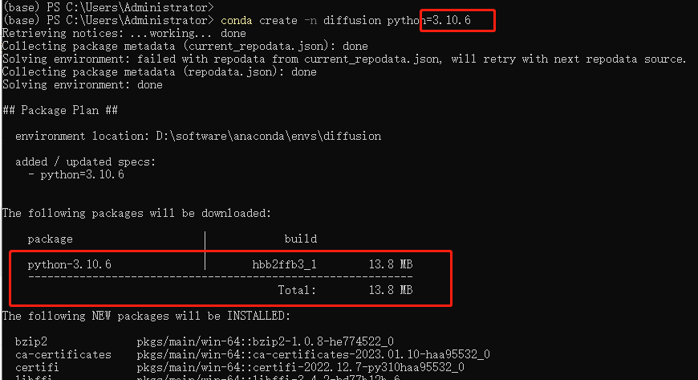
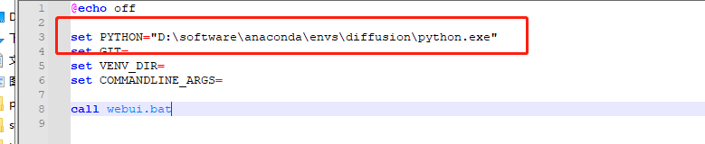
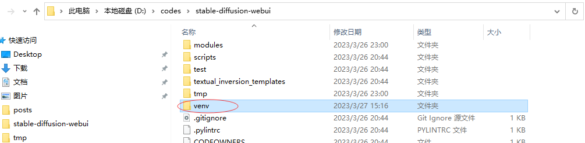
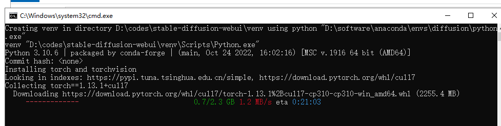
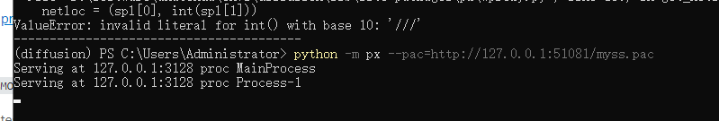
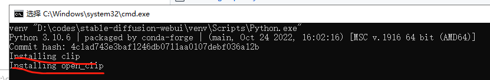
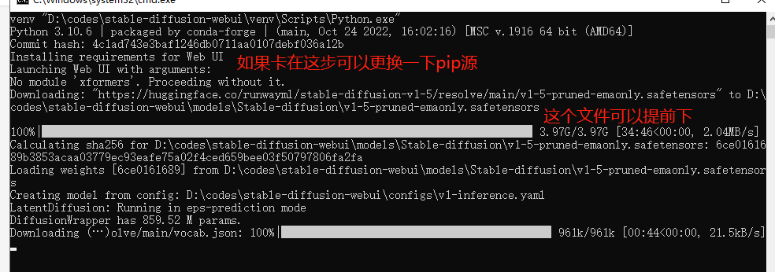

#  【技术总结】用anaconda配置diffusion环境

最近迷上了 Stable Diffusion web UI。

不过这个家伙似乎只能用 3.10.6版本的python。 

难道不能用anaconda吗？网上的教程都非常的少， 我觉得很好奇。 抱着试试看的心情， 尝试一下。


1) 创建一个新的conda环境， python版本选择3.10.6：




2) 下载stable-diffusion代码，解压。这个不用多说

3) 最关键的一步在这里：

   编辑webui-user.bat文件, 把刚才创建的anaconda的新环境的python.exe路径赋值给PYTHON这个环境变量，这样stable diffusion才会用这个版本的python



4) 也是关键的一步（重新安装的时候也是非常关键的一步）： 把venv目录整个删掉。如果之前环境配错了，比如python版本不对，要重新安装，更是要把这个目录删掉

   


5) 执行webui-user.bat进行安装，然后等就行了




6) clip clone不下来的解决办法

但是安装的时候可能会遇到各种下载不下来的报错， 最典型的就是clip下载不下来的问题， 可能是由于git没有使用代理导致的。 

由于本人的代理使用的是vpn（通过pac文件方式），所以不能简单的用http代理搞定

可以用这个办法

https://stackoverflow.com/questions/40869715/git-access-git-using-proxy-with-pac-file

先用python安装一个 px ：

python -m pip install px-proxy

安装完之后制定pac文件路径并且运行： 

python -m px --pac=http://127.0.0.1:51081/myss.pac



他会根据pac文件在 127.0.0.1:3128 启动代理

然后给git设置一个代理：

```
git config --global http.proxy http://127.0.0.1:3128
```

然后重新执行webui-user.bat 执行安装， 过一会之后， 看到clip就安装过去了




7) 安装时找不到版本的处理方法：

   如果安装的时候报找不到版本， 那可能就是当前的几个源都没有相应版本，比如gradio，各个镜像源都只有3.22版本没有3.23版本

   解决的方法是增加上 https://pypi.org/simple 源。 一下pip.ini内容供参考：

   | [global]<br/>index-url = https://pypi.douban.com/simple<br/>extra-index-url = https://pypi.tuna.tsinghua.edu.cn/simple<br/>                = https://mirrors.aliyun.com/pypi/simple<br/>                = ***https://pypi.org/simple***<br/>trusted-host = https://pypi.douban.com |
   | ------------------------------------------------------------ |
   
8) 如果遇到下载不下来的问题， 建议多更换pip源尝试




