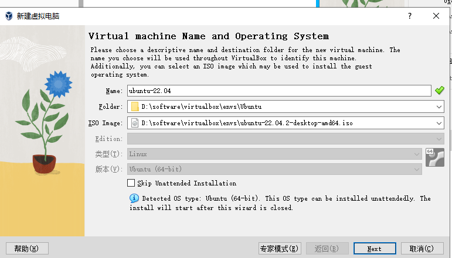
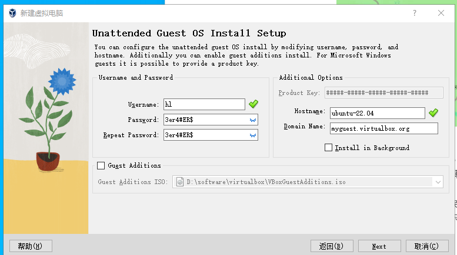
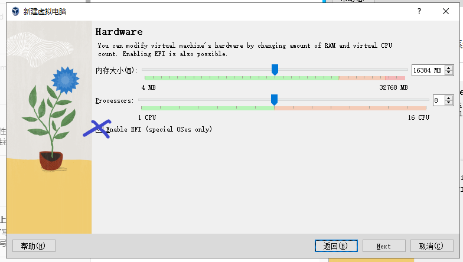
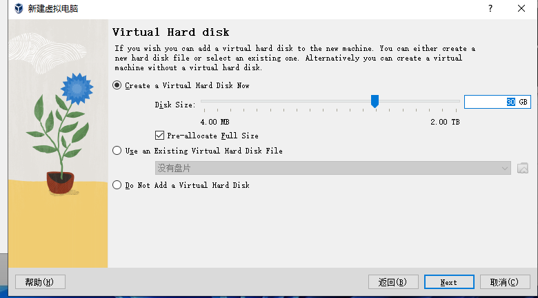
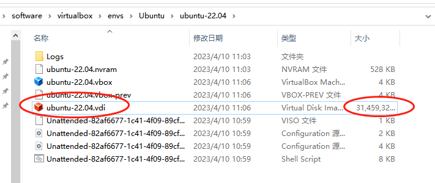
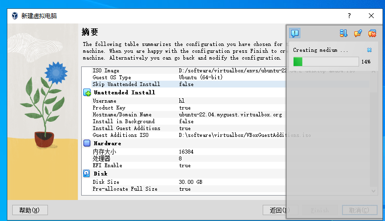
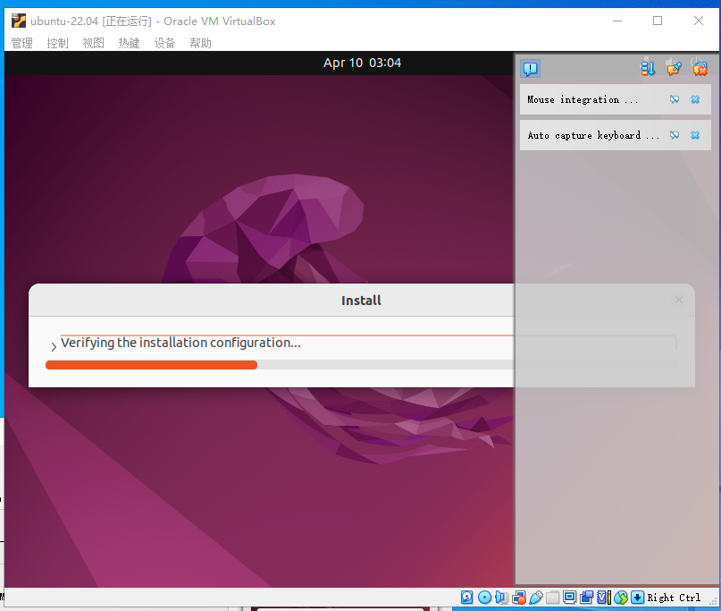
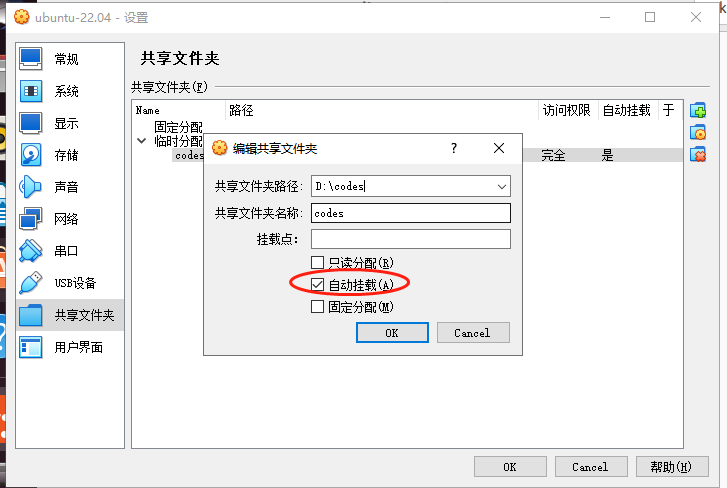
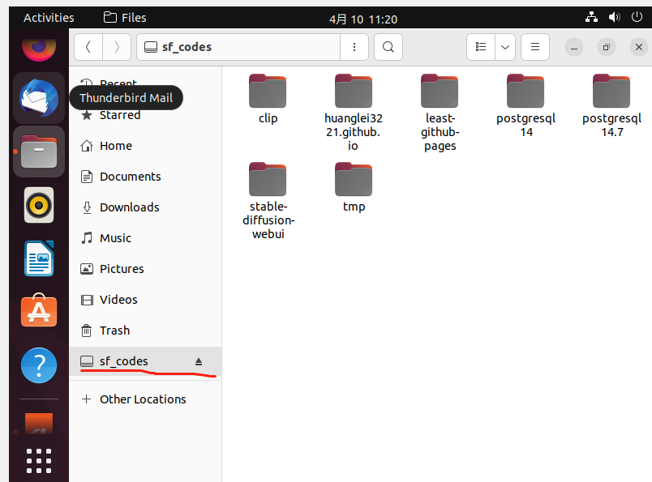

先装一个virtualbox。

然后下载ubuntu版本镜像，创建一个新的虚拟机：

enableEFI 不要勾选， 否则会导致启动失败， 虽然现在的主板已经多数使用UEFI系统而不是bios系统了， 

然后内存和处理器的话勾到一半就行了。

虚拟硬盘不需要太大， 因为我们可以通过挂载目录添加硬盘

勾之后会在那个环境目录下创建一个vdi文件

然后等它安装就行了：

通过shared folders来共享文件夹，哈哈哈

