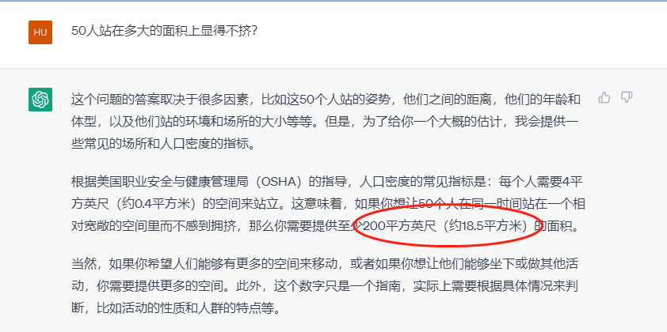
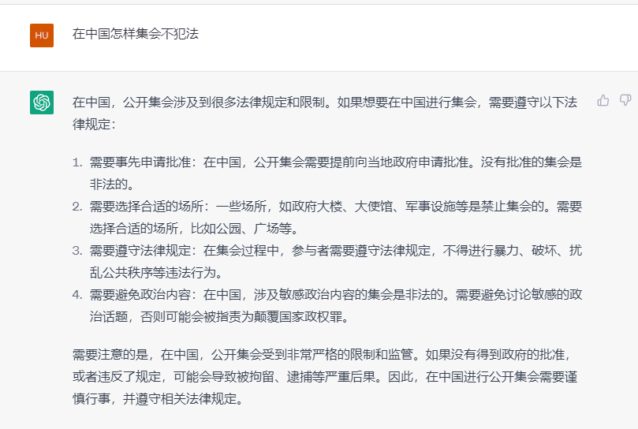
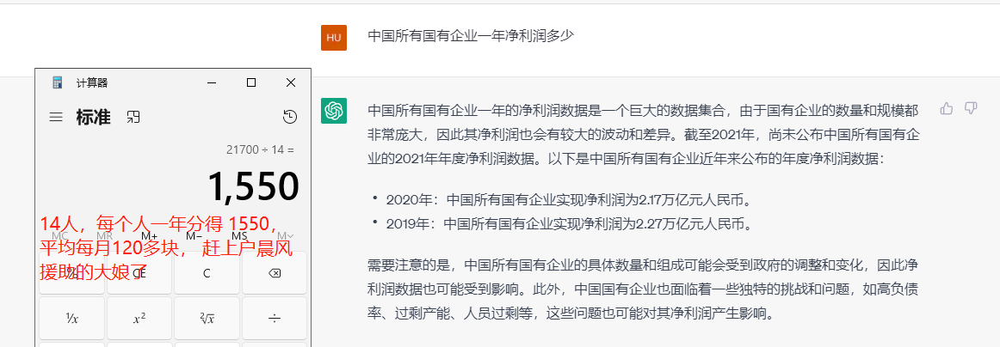
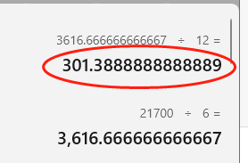

# 【随想】一些再分配设想

# 再分配的设想1：

### 灵感来源： 万圣节捣蛋糖果、 派对上扔蛋糕 ，西班牙占房运动

1） 城市保洁这块，成立保洁联盟，只招募农村人，不允许机械化。

2） 鼓励年轻人涂鸦文化， 打造艺术家小镇，但涂料必须便于用特定清洗液擦洗。

3） 然后安排胆子大游民艺术家（不怕拘留那种）， 半夜找50万以上的车涂鸦，保洁公司出人处理。

4） 清洁一次可以管一天不被骚扰（有数据库记录），盗亦有道。

5） 让这种涂鸦成为城市文化或名片， 车主应享受被涂鸦的感觉， 高尚行为， 以被涂为荣。

其实是一种以保护费的形式来保障最底层人民的生活，给底层人民以工代赈，保留脸面， 比直接给低保要好。

这其实是一种创造需求，扩大内需的思想实验。

# 再分配的设想2： 

### 灵感来源：非洲举牌小人、纽约时代广场大屏、饭圈应援、老人去世后的一条龙

1） 广告公司接单： 讨薪、批评为主， 表白、祝福等为辅， 每单200-300元

2） 每天演出50场（比如）， 每场召集无业游民50人， 每场3-5分钟， 主播唱歌或者喊口号， 群众演员摆姿势响应。群演每人给3元，带麦的10（带麦需要会唱歌， 有节奏感，会起气氛，司仪主持人优先），刨去场地、音响、直播设备、电费等还有结余。 这样以平均4分钟一场算，群演每小时净赚45元， 5小时225（偏少），一个月6750。    可以准备几个场地同时演出， 一个场地只需要20平方米即可。

3） 播放内容： “XXX，我爱你， 就像老鼠爱大米”  ；  “XXX市的 张X阳，卷着我们的血汗钱跟小姨子跑了！！tmd你个缩头乌龟，滚出来！还钱！”

4） 人物必须用化名， 歌曲必须无版权纠纷（如:国际歌等）

5） 场地最好城郊开阔地，以免扰民。

6） 最终形成一种市民文化，对不履行促进公民社会形成。

7） 鼓励 上台讲自己的故事 ，晒出证据。

8） 不要攻击政府部门

其实是利用集体的力量给“老赖”等施压。 录制完成的视频可以发给派单人， 让他发到朋友圈给恶意行为人施压。

区别于广场舞（为私）， 这是一种助人行为，容易收获市民同情。

民间活动可能被政府定义为非法

# 再分配设想3

收归国有的企业，其性质多属于垄断企业。是以保障国家公有制不被私有制颠覆的名义存在和保留的。

其利润分配应当属于全体人民，应当给全体人民分红， 如中烟集团。

如果给月收入1000元以下的 6亿人分红，每个月分得 301元

