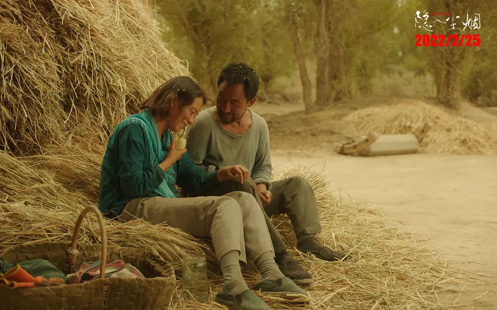

#  从《隐入尘烟》看农民之苦

最近看了一部电影《隐入尘烟》。这部电影是让人看了比较堵的那种

看了电影，想到一些问题：

## 一、老实人是怎么被塑造出来的？

电影中反复出现的字眼就是“使唤”。其实“使唤”一个是一个相对没有那么强烈感情色彩的贬义词， 强烈一点就是剥削和压迫。

诚然，故事的主人公： 老四和桂英两口子就是各种团体剥削和压迫的对象

收粮食的压迫他们：不停的从老四身上抽熊猫血，又不给他相应的补偿，每次抽血，顶多就是给他吃顿饭，没有给多少恩惠，还要装出施了大恩的样子。（生活中就是有这样的人：他们没有帮你多少却想让你感恩戴德）

家里人压迫他们：搬家的时候，老三自己舍不得花钱就使唤老四拉，老四也不好意思拒绝。

村民压迫他们：他们说桂英身上脏，不让小孩和她玩，这种疏离，是一种隐形的压迫。

他们面对种种压迫，没有一声反抗。因为他们是老实人，让我联想起之前很火但翻车了的二舅。他们都勤勤恳恳但是依旧被生活压得喘不过气来。不同的是二舅的作者更狡猾一点，他通过视频传递出一种“老实是福”的感觉，所以被各大主流媒体广泛转载，一时风光无限。

说实话，我无法认同这种“老实是福”的观点，他们是被环境观念绑架出来的老实人，只要简单的代入角色就能感觉到这种扑面而来的“绑架”： 你不当老实人给收粮的献血全村粮食卖不出去怎么办？你不当老实人给我当免费劳力还是不是我兄弟？看似有选择，实际没有选择。他们被塑造了这样一种观念：“你是一个弱者，要不是我帮你，你早就gg了， 所以你要感恩， 不要抱怨，不要反抗，赶紧的，给我xxx”。他们在一次又一次的这种强化下，被塑造成了失去反抗能力，只能坐以待毙的窝囊样子，他们天生也许并不想成为老实人，但无可奈何，因为再这样的环境下，弱者是没有话语权的，只能是老实人。

联想到陶华碧早年的经历：开个摊子，整天和工商打架，和税务干架，最后才打出一片天。要是老干妈也是个软柿子，恐怕也早就gg了吧。

## 二、农民为什么变得这么穷困？

农民为什么这么穷困，让我想起最近看李佐军在10年多前写的《人本主义改革》一书，书中对于我国改革开放前30年的诸多问题做了分析，很值得一看，可惜这样的书现在几本读不到了。

书中尖锐的指出：当前中国的主要经济矛盾已经不再是市场经济和计划经济的矛盾，而是市场经济和改革之初的临时制度（如双轨制）之间的矛盾，是市场公平和既得利益集团之间的矛盾了。

改革开放初期，从计划经济转向市场经济，有很多临时性的政策，比如各种双轨制。那么随着改革开放的深入， 这些当初的临时性的，不公平的政策其实应该取消或者改善掉。比如农民的医保和城市的医保并轨问题，但由于历史的原因，任务还是非常艰巨。

所以农民的贫困真的不能怪农民自己，社会造就了他们相对弱势的地位。要不是2003年农业税废除，那每个农民身上至今还是要承担一种任务——给城市输血。

好在国家在提升农民生活水平上还是下了不少功夫的，比如攻坚扶贫、扫黑除恶等等等等

再比如发展拼多多、抖音直播这些电商，把供给方和需求方更紧密的联系在了一起，让中间商不那么容易赚差价，收粮人的脸也就不需要看了。

片中的老四后来也分了房子，不过分房子是否解决了老四的困难了呢？似乎没有，因为接着带来另一个尖锐的问题：住进楼房，还怎么养活自己？

## 三、失去生产资料那些人怎么办？

电影中我们看到政府其实是给困难户以补偿的，老四他们家政府给了一套房，还挺大。可惜没人能回答老四最关切的问题：搬进楼房了，那驴子、鸡、麦子怎么办？随着老四门搬进了楼房，他们其实也便失去了生产资料，被迫和生产要素分离了，这样的老四，今后要靠什么养活自己呢？

其实这个问题关系到后工业时代被“圈地”的每一个人，他们无法生产，技能也无法匹配当今工业水平，如果得活？

想来想去恐怕只有提高社会福利一条路，让这些被迫“下岗”的人有过冬的棉袄，慢慢培养职业技能。 当有人无法通过劳动养活自己的时候，不是更应该借助社会援助的力量吗？

目前国家财政只有3%用在公共福利支出上，还有很长的路要走。

## 四、为什么这种题材现在很少见？

他们是农村的最弱势群体，也算是总书记嘴里最牵挂的困难群众了，可惜的是：这些困难群众的状态和经历在当下的影视作品中几乎看不到，不能不说是一种遗憾。原因嘛，自然也不难想到，大抵是因为政治不正确吧，毕竟大地神州已经全面建成了小康社会。

而且就连这部电影，再内地也已经找不到资源了。

联想到最近非常火的“户晨风被炸号事件”，未来还有谁替这些人说话呢？

我觉得对于一个想要建立道路自信的国家不应如此。承认这个社会发展过程中有缺陷然后改好他才是一个正面的心态。我们知道改革开放以来城乡出现了巨大的差距，但改革从来都不是完美的，改革总有受益者和失意者，但我们不应该漠视失意者（甚至“消失”掉他们），也不应该放弃改革走计划经济的老路，反而需要深化改革，把既得利益群体的蛋糕分给没受益的人。

