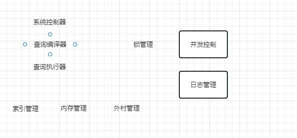
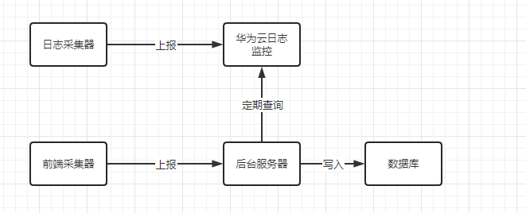
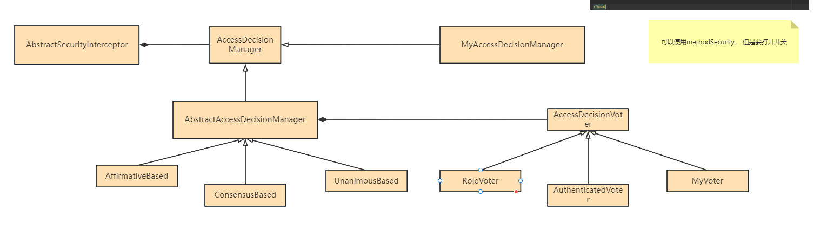
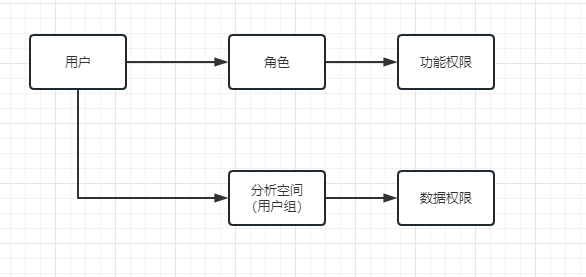

layout: post
title:  "一些工作经历的总结"
date:   2023-03-15 13:25:24 +0800
tags: thinking
categories:  技术

#  一些工作经历的总结


一个成熟的产品，从设计到开发是一个完整的过程， 我们很多时候把设计和开发割裂开来， 这是不对的。

第一步：先了解需求，看看我们到底要做什么

这个时候比较有用的工具就是UseCase图： 


## 第一段工作： 

UDA统一数据访问：

postgresql系统架构：



运营商，同表不同源（表结构相同， 但是数据源不相同） hive   greenplum oracle  等

背景： 电信运营商数据量庞大，分库分表现象严重，分析师常要在不同数据库之间取数和分析，工作量极大且容易出错，亟需一款产品，可以写一套SQL就可以访问不同的数据库，以便降低工作量，UDA即是为此而生。本产品在Postgresql源码基础上进行了大量修改（代码量20w+）


主要工作： 1）明确需求，设计了一种虚拟表， 这种表叫逻辑表

```
CREATE SERVER s1
        FOREIGN DATA WRAPPER postgres_fdw
        OPTIONS (host '192.83.123.89', port '5432', dbname 'foreign_db');
```

```
CREATE SERVER s2
        FOREIGN DATA WRAPPER oracle_fdw
        OPTIONS (host '192.83.123.89', port '5432', dbname 'foreign_db');
```

create foreign server b...;

create logic table  a（c1 int, c2  text）distributted by c1 (

​	range(,0)  server s1,

   range [0,]  server s2

);

create logic table  b（c1 int, c2  text）distributted by c1 (

​	range(,0)  server s1,

   range [0,]  server s2

);

2）逻辑架构比较清晰， 我们要看那些模块需要修改：

查询编译器、增加了关键词logic table

查询优化器

外部数据封装器： 做SQL转换用的     比如phoenix 中的upsert into 而不是 insert into ； 再比如 to_char   to_number 这些可能不支持

主备切换， 还要修改日志管理器

系统表的初始化需要修改。

3） 关键技术点

a) 路由功能

b) 两表 join的代价估算 ： 

select a.c1 , b.c2 from a inner join b where a.c1 = b.c1

c) 执行计划转换成SQL方言下发到不同数据源

d) 主备切换： zookeeper。 监听同一个mastermode ， 抢占，成为主节点， 其他节点成为从节点

同时在zk上写一个selfnode， 标识自己的负载（连接数），  jdbc驱动做了改造。连接到负载较低的节点去


## 第二段工作

后来组织调整， 业务软件不能开发平台型部件，作为内部组件使用， 于是就到投入到下一段工作

平台运营， 类似elk 



选型上花了一些时间， 云上有埋点工具不给我们用， 云上基础设施才能用， 只好自己埋点，

选型piwik （matomo）

主要基于springboot ，对等集群，

大屏，用的是grafana进行展示。


## 第三段工作

换部门了，

流程it进行数字化转型比较成功，华为数据之道能力外溢

企业bg要发力


华为数据之道的核心思想就是信息架构， 围绕业务对象进行管理， 和传统数据治理不一样， 传统的数据治理是围绕数据目录的， 存在哪个目录下。

梳理信息架构把业务中所有涉及的对象整明白了， 比如  发票、 订单、

发票里面又有发票头、发票体，对象的不同部分， 就叫逻辑实体。


数据底座， 数据汇聚， 从源系统汇聚到数据湖， 数据湖中的表结构是完全按照信息架构梳理的

比如，源系统中有三个字段， 但是信息架构只有2个，那么源系统中的字段要被丢弃


梳理信息架构（业务元数据）（信息架构委员会编辑信息架构） --》 数据普查（技术元数据） --》 数据入湖 （业务和技术的关联）（管家要进行审核） --》 创建分析空间进行数据消费 --》 申请数据进入分析空间 （需要分析空间的管理员 和 信息架构的管家/owner进行审批）


内部公开 —— 直接申请使用

秘密  机密、绝密 —— 需要审核


SSO登录

1） 发现用户没有携带回话标识， 要重定向到应用的登录页面

2） 应用登录完成后，回调dmap的前端回调地址（显示登录中）， 携带授权码

3）前端要把授权码发给后端， 后端用授权码去换access token

4） 后端再根据accessToken去换取用户信息， 如用户名等

5） 生成一个唯一的会话标识， 把会话标识写到里面


利用springsecurity进行认证 和鉴权

自定义投票器




rbac权限模型




https://www.processon.com/diagraming/62412e8e0e3e74078d4fc669


