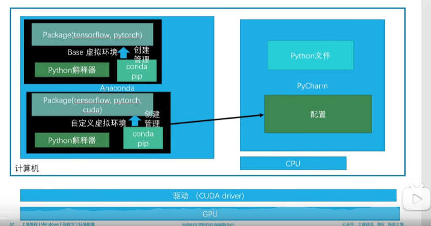
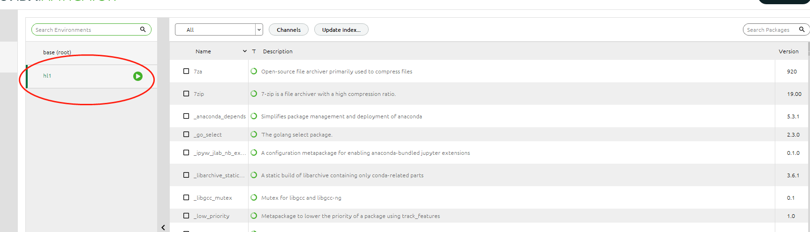
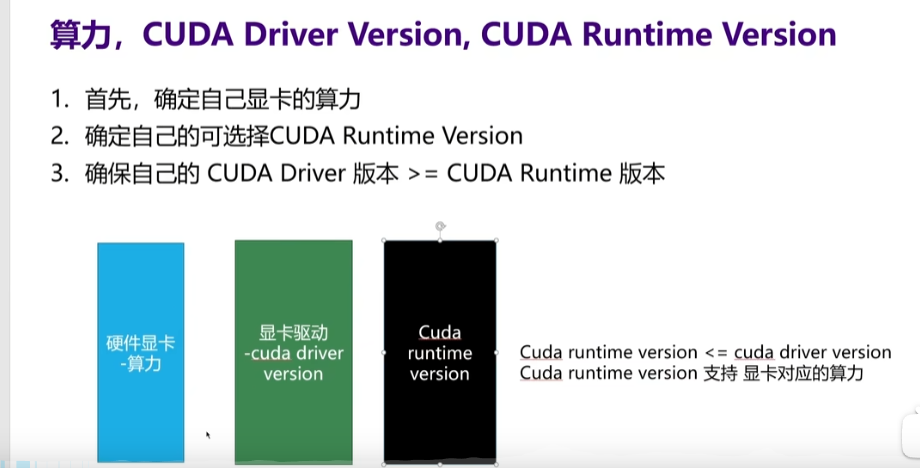
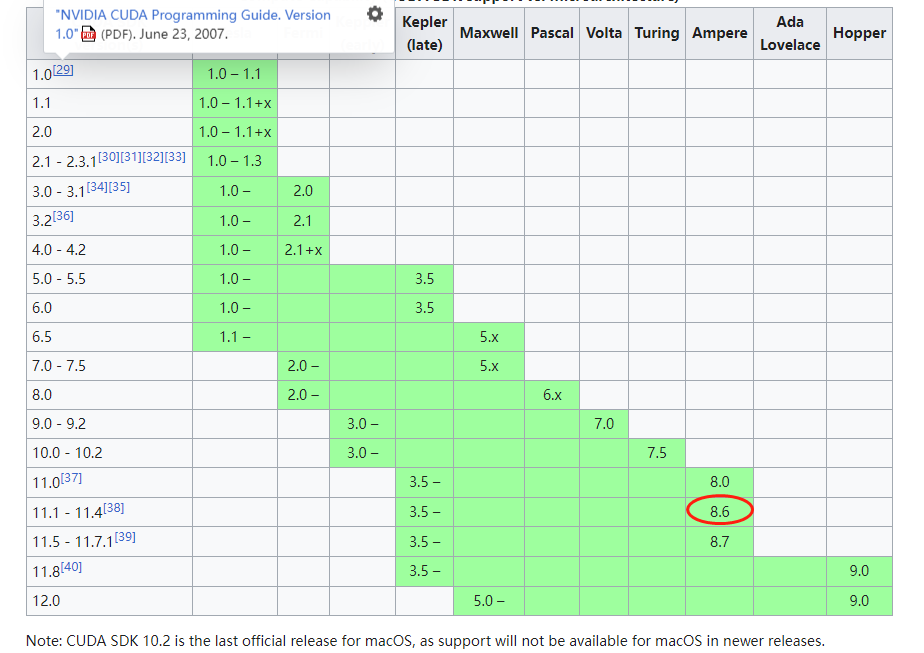
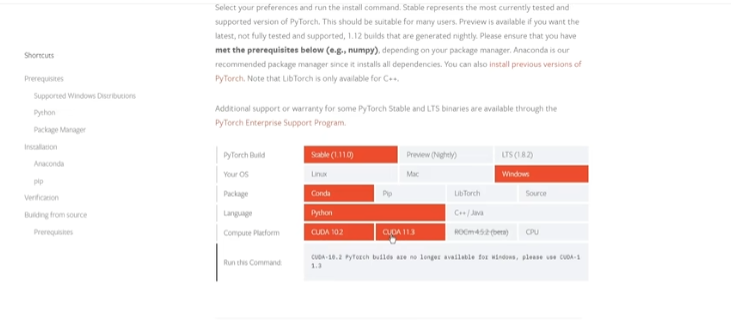
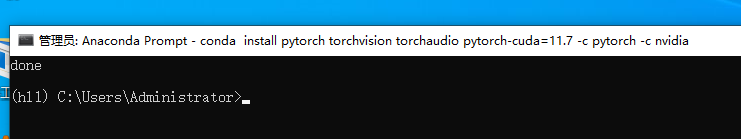
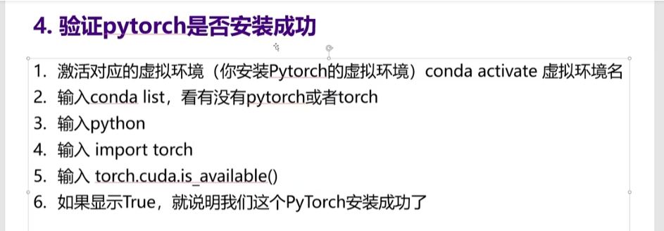
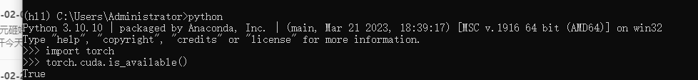

zhuyao


主要根据这篇文章来做的：

https://www.bilibili.com/video/BV1S5411X7FY?p=21&vd_source=1115a1b57e46edddf88be0738ef3f5b2


先看看anaconda的架构： 

他是一个python+conda的集成开发环境， 并且它支持在不同的环境间进行切换， 就很nice， 如图： 




1) 安装anaconda

   很简单， 就不赘述了，直接从官网下载安装即可。安装完成之后，可以创建一个环境，我创建的就叫hl1:




2) 创建虚拟环境

conda env list

conda create -n hl1 python=3.10

conda active hl1


3) 选择cuda版本：

也就是说要选择一个适合自己算力的cuda版本 




本机的3070 对应算力是8.6， 参见https://en.wikipedia.org/wiki/CUDA




那就要用11.1-11.4版本


4) 执行安装

安装pytouch的命令行参数： 参见官网， 选择cuda的版本



```
conda install pytorch torchvision torchaudio pytorch-cuda=11.7 -c pytorch -c nvidia
```

这个命令中的-c 表示通道， 如果国外网站比较慢， 就使用一些国内通道。


装完之后：




5) 安装后验证






