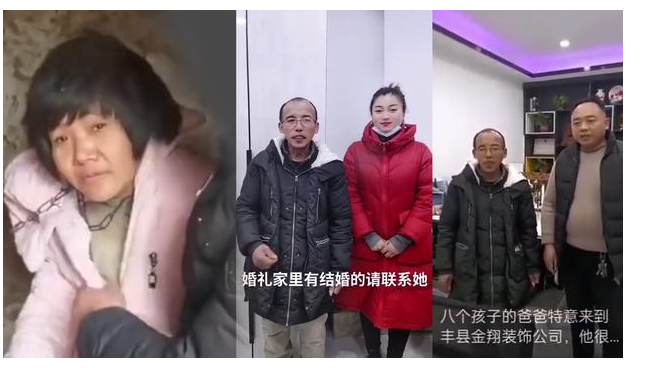

# 最近的随想——天门山、铁链女、新冠溯源

## 天门山跳崖事件

这真的是一场悲剧。4个年轻的生命就这样没了。

选择走这条路的人，一定是看未来一片暗淡，没有希望。

社会的发展正在急速的抛弃没有文化的人， 他们的选择如此的窄，以至于走投无路。

想起前几天和我兄弟聊天， 他感慨说你没有见过真正的底层， 我承认。

你不要问为什么社会底层的人如此容易放弃，得过且过？ 他们上升的途径本身就非常少，机械的、没有生气的、超负荷的工作消耗了他们的生命，回到家连说话的力气都没有， 一天天只有干活吃饭睡觉，一睁眼仿佛就可以看到自己已经注定的未来，是怎样的绝望？ 况且清贫的家底也根本容不得他们歇歇躺躺，怎么办？他们累了，想休息了。

 能从贫困中跳出来的永远只有少部分人，像《算命》纪录片中唐小雁那样有生命力，泼辣的人或许才行，但稍有不慎又可能踩到法律的网。 有几个人能有这种特质和幸运呢？ 大多数人注定只能被磨去了棱角，套上了绳索，两眼无神的活着。

有人可能会说：人间有真情，有真爱，为了你的亲人你也要活下去。

可是，有力气才能去爱啊，如果生活本身就已经消耗了全部的能量，甚至把身心都掏空了，拿什么去爱？或许只有死才是一种解脱

## 铁链女的事件

铁链女小花梅的男人董志民，家里物质条件极度匮乏，还要拉扯一帮小孩，再要去面对一个随时要到处乱跑的精神病人怎么搞？很显然他采取了最简单的办法 —— 把女人像狗一样拴起来，因为他和女人没有什么感情，只把她当做生育工具。这个狗链锁黑屋的场景我似曾相识，因为《算命》里面的石珍珠开始就是这样被亲哥哥对待的，好在石珍珠遇到了好人厉百程，小花梅没有。如此看来，这种对待精神病人的手段在农村绝对不是个例。

那我们来倒推一下：

1)  董志民特么这么穷为什么还要那么多小孩呢？

   从他的一些话就能看出来：让他们看看我家里有人 ...   我就不信这八个娃当中没有一个出人头地... 之类

   那么这是他自己的观点还是当地普遍的观点？ 

看了徐州政府的骚操作之后我就理解了：这肯定是当地普遍观点，因为徐州政府曾经还试图把这个爸爸打造成爱心典型，这说明当地政府打从心里就鼓励你养活最多的人口，至于养活的质量他们是不在乎的， 活着就行。这似乎和当年鼓吹“袁厉害”是一模一样的。 那政府都是这个思路， 民间自然不用说了。可以想见，这种“开盲盒抽大奖”式的生娃思想在农村依然非常普遍。

2) 那么如果农村人不多生点小孩会有什么后果呢？ 

   很显然， 结合以前户晨风被封号的视频来看，那就是农村的社保根本不够你防老！ 关于这点，讲《隐入尘烟》的那篇文章里面我也写了。 而且从他自己说的话来看：家里没人显然是要被鄙视和欺负的。

所以这也就解释了董志民不惜犯法也要买个老婆来给他生崽的原因：一来群体共识，二来养老压力。

比起董志民，更令人生气的是丰县政府在整个事件中的作为：

1）20年间对铁链女视若无睹（既然已经办了低保，那肯定是见过的）

2）发现八孩爸火了开始树为爱心典型！

3）发现铁链女上热搜了，疯狂隐瞒删帖控评降热度，甚至否认拐卖

4）发现群众想去探望拼命阻挠

5）发现民意汹涌，急忙拉出董志明等人“斩首示众”以平民愤。

说白了都是一种捂盖子和甩锅思维

# 新冠溯源

很显然，当年封锁华南海鲜市场捂盖子没有公布相关数据，是有过失的。

貉真的就是中间宿主吗？或许很有可能，可惜现场早早的破坏了，什么都没留下（或许留下了却又不公布？）

为什么我们的政府在面对公众事件的时候，第一个想到的就是捂盖子？因为是无限责任政府？ 那为什么就一定要是无限责任政府呢？没人逼你啊？说白了，想管得的太多又不肯放手，当让也就无限责任了，因为你根本怪不到其他任何的组织和个人，他们没有权力也就无法承担任何责任。

为什么不肯放权？因为权力带来的好处太多了，太爽了。

